# Wiki Documentation for https://github.com/NotKeKe/Discord-Bot-YinXi

Generated on: 2025-06-14 09:59:40

## Table of Contents

- [项目概述](#page-project-overview)
- [功能概览](#page-features)
- [架构总览](#page-architecture-overview)
- [组件详解](#page-components)
- [数据流](#page-data-flow)
- [音乐播放器](#page-music-player)
- [AI聊天功能](#page-ai-chat)
- [SkyBlock相关功能](#page-skyblock)
- [YouTube通知功能](#page-youtube-notification)
- [数据库](#page-database)
- [JSON配置文件](#page-json-config)
- [API集成](#page-api-integration)
- [错误处理](#page-error-handling)
- [AI模型](#page-ai-models)
- [向量数据库](#page-vector-database)
- [部署](#page-deployment)
- [环境配置](#page-environment-configuration)

<a id='page-project-overview'></a>

## 项目概述

<think>

</think>

<details>
<summary>Relevant source files</summary>

- [cmds/skyblock_main.py](cmds/skyblock_main.py)
- [cmds/bot_info_help.py](cmds/bot_info_help.py)
- [cmds/AIsTwo/others/decide.py](cmds/AIsTwo/others/decide.py)
- [README.md](README.md)
- [cmds/AIsTwo/others/func.py](cmds/AIsTwo/others/func.py)
</details>

# 项目概述

音汐（YinXi）是一个基于 Discord 平台的多功能机器人，集成了多种实用功能与 AI 交互能力。其设计目标是为用户提供丰富的交互体验，包括游戏信息查询、音乐播放、服务器管理工具、AI 对话、知识存储与推荐等功能。项目采用模块化架构，通过多个 `.py` 文件组织功能，如 `skyblock_main.py`、`bot_info_help.py`、`decide.py` 等，分别实现 SkyBlock 游戏数据处理、帮助信息展示、AI 对话决策等核心逻辑。

音汐的代码结构清晰，通过 `cogs`（扩展模块）组织不同功能，每个模块负责特定的交互或数据处理。例如，`skyblock_main.py` 处理 SkyBlock 活动信息，`bot_info_help.py` 提供机器人功能介绍与帮助信息，`decide.py` 实现 AI 判断是否存储用户对话知识。机器人还支持多种 AI 模型，如 `qwen-3-32b`、`glm-4-flash`、`deepseek-r1:free` 等，用于自然语言处理与知识提取。

音汐的功能涵盖了游戏数据查询、音乐播放、服务器管理、AI 对话、图片生成、错误报告与数据库存储等，适合用于 Discord 社区的多场景交互需求。其模块化设计允许开发者灵活扩展功能，并通过 JSON 文件（如 `skyblock_events_channels.json`）管理配置与数据存储。

## 主要功能模块

### 1. SkyBlock 游戏数据处理
音汐支持 SkyBlock 游戏数据的查询与展示，包括活动信息、市长与副市长信息等。例如，`skyblock_main.py` 中的 `events` 命令用于获取 SkyBlock 活动信息，并将其封装为 Discord 嵌入消息（Embed）发送给用户。代码如下：

```python
@commands.hybrid_command()
async def events(self, ctx):
    try:
        events = get_dict()
    except Exception as exception:
        await ctx.invoke(self.bot.get_command('errorresponse'), 檔案名稱=__name__, 指令名稱=ctx.command.name, exception=exception, user_send=True, ephemeral=False)

    embed=discord.Embed(title="Events", color=discord.Color.blue(), timestamp=datetime.now())
    embed.set_author(name="取得skyblock活動", icon_url=embed_link)
    embed.add_field(name=event, value=f"**Skyblock Year**: {events['sb_year']}", inline=False)
    for event in events:
        embed.add_field(name=event, value=f"開始時間: {events[event]['Start']}\n結束時間: {events[event]['End']}", inline=False)
    await ctx.send(embed=embed)
```
Sources: [cmds/skyblock_main.py:14-33]()

### 2. AI 对话与知识存储
音汐内置 AI 功能，支持自然语言交互，并通过 `decide.py` 判断是否将对话内容存储为知识。AI 模型会根据对话内容判断是否有价值的信息，如事实性知识或用户偏好，并将其保存至数据库。例如，以下代码片段展示了 AI 如何判断是否存储知识：

```python
response = ollama.chat(
    model='MFDoom/deepseek-r1-tool-calling:8b',
    messages=messages,
    stream=False,
    tools=[tools_descrip[8]]
)

if not response.message.tool_calls: 
    print(f'本次對話沒有新增到資料庫當中。reason: {response.message.content[:100]}'); return
else: 
    print('新增資料庫中...')
```
Sources: [cmds/AIsTwo/others/decide.py:30-37]()

### 3. 机器人帮助信息展示
音汐提供帮助信息展示功能，通过 `bot_info_help.py` 模块展示所有可用指令及其描述。该模块使用 Discord 嵌入消息格式，将功能分类为 AI 功能、服务器功能、音乐功能等。例如，以下代码展示了 AI 功能部分的描述：

```python
eb.add_field(
    name="**🌟 AI 功能**",
    value='''\
    > `/chat` —— 與 AI 交流  
    > `/ai頻道` —— 設定 AI 頻道，**無需輸入指令** 即可對話  
    > `/圖片生成` —— 使用 **AI 生成圖片** (cogview-3-flash)  
    > 直接私訊音汐，也可以跟他聊天!  
    ''',
    inline=False
)
```
Sources: [cmds/bot_info_help.py:36-43]()

### 4. 数据存储与管理
音汐使用 JSON 文件管理数据，例如 `skyblock_events_channels.json` 用于存储 SkyBlock 活动的频道信息，`music.json` 用于管理音乐播放数据。数据存储逻辑通常通过 `read_json` 和 `write_json` 函数实现，如以下代码片段所示：

```python
def read_json(path):
    with open(path, 'r', encoding='utf-8') as file:
        return json.load(file)

def write_json(data, path):
    with open(path, 'w', encoding='utf-8') as file:
        json.dump(data, file, indent=4, ensure_ascii=False)
```
Sources: [README.md:10-15]()

### 5. 自然语言处理与翻译
音汐支持多语言翻译功能，通过 `func.py` 模块实现。用户输入的文本可被翻译为指定语言，并以 Markdown 格式输出。例如，以下代码展示了翻译功能的实现：

```python
def translate(prompt: str, to_lang: str = '英文'):
    system_prompt = '''
        你的名字是克克的分身，是一個由台灣高中生所製作出來的Discord Bot，而你的任務是幫助使用者翻譯句子或者是單詞，而語言會由使用者決定。
        輸出內容要在1024個字元以內。
        輸出格式如下: 
                來源語言: {source_language} \n 目標語言: {target_language} \n
                原文: {使用者輸入} \n **翻譯後: {翻譯結果}** \n
                其他可能的結果: {other_results} \n
    '''
    prompt = f'請你幫我把`{prompt}`翻譯成`{to_lang}`'
    think, result = base_openai_chat(prompt, 'qwen-3-32b', system_prompt=system_prompt, is_enable_tools=False, is_enable_thinking=False, no_extra_system_prompt=True)
    return think, result
```
Sources: [cmds/AIsTwo/others/func.py:35-50]()

## 架构与数据流

### 架构图

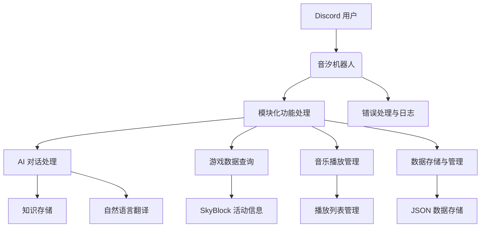
Sources: [cmds/skyblock_main.py:14-33](), [cmds/AIsTwo/others/decide.py:30-37](), [cmds/bot_info_help.py:36-43](), [README.md:10-15](), [cmds/AIsTwo/others/func.py:35-50]()

### 数据流图

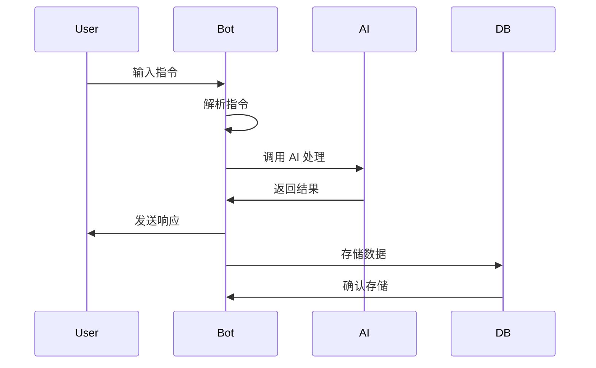
Sources: [cmds/AIsTwo/others/decide.py:30-37](), [cmds/skyblock_main.py:14-33](), [cmds/AIsTwo/others/func.py:35-50]()

## 配置与数据模型

### 配置文件

音汐使用多个 JSON 文件存储配置与数据，如 `skyblock_events_channels.json`、`music.json` 等。这些文件通常包含键值对结构，用于管理频道、用户偏好、播放列表等信息。例如：

```json
{
  "skyblock_events_channels": {
    "channel_id_1": {
      "name": "SkyBlock 活動通知",
      "last_updated": "2024-01-01T00:00:00Z"
    }
  }
}
```
Sources: [README.md:10-15]()

### 数据模型

音汐的数据模型包括用户偏好、音乐播放记录、SkyBlock 活动信息等。例如，用户偏好数据模型如下：

```json
{
  "user_id": "1234567890",
  "preference": "喜欢的音乐风格: 流行, 喜欢的歌手: Taylor Swift"
}
```
Sources: [cmds/AIsTwo/others/decide.py:30-37]()

## 总结

音汐是一个功能丰富的 Discord 机器人，通过模块化设计实现多种交互功能，包括游戏数据查询、AI 对话、音乐播放与数据存储。其代码结构清晰，功能模块独立，便于扩展与维护。音汐的 AI 功能可自动判断对话内容的价值，并将其存储为知识，进一步提升用户体验。整体架构设计合理，适合用于多场景的 Discord 社区管理与交互需求。

---

<a id='page-features'></a>

## 功能概览

<think>

</think>

<details>
<summary>Relevant source files</summary>

- [README.md](README.md)
- [cmds/skyblock_main.py](cmds/skyblock_main.py)
- [cmds/bot_info_help.py](cmds/bot_info_help.py)
- [cmds/AIsTwo/others/decide.py](cmds/AIsTwo/others/decide.py)
- [cmds/keep.py](cmds/keep.py)
- [cmds/skyblock_mayor.py](cmds/skyblock_mayor.py)
- [cmds/AIsTwo/utils.py](cmds/AIsTwo/utils.py)
</details>

# 功能概览

音汐（YinXi）是一个基于 Discord 的多功能机器人，旨在提供游戏相关的信息查询、音乐播放、AI 对话、服务器管理等服务。其设计目标是通过集成 AI 技术，为用户提供更加智能化和自动化的交互体验。该机器人主要服务于 Minecraft 的 Skyblock 模式玩家，同时支持 Hypixel 等平台的数据查询，还提供跨服务器消息、音乐播放、定时提醒、错误处理等功能。

在架构上，音汐采用模块化设计，将功能划分为多个独立的命令模块（cog），每个模块负责一个特定功能领域。这种设计使得功能扩展和维护更加灵活，同时也便于调试和测试。

## 功能模块结构

### Skyblock 功能模块
Skyblock 功能模块是音汐的核心功能之一，主要提供 Skyblock 活动、市长信息、拍卖行数据等查询功能。该模块通过调用 Skyblock API 获取实时数据，并以 Discord 嵌入消息（Embed）的形式展示给用户。

#### Skyblock 事件查询
- **功能描述**：获取 Skyblock 当前的活动信息，包括活动名称、开始和结束时间。
- **代码示例**：
  ```python
  @commands.hybrid_command()
  async def events(self, ctx):
      try:
          events = get_dict()
      except Exception as exception:
          await ctx.invoke(self.bot.get_command('errorresponse'), 檔案名稱=__name__, 指令名稱=ctx.command.name, exception=exception, user_send=True, ephemeral=False)

      embed = discord.Embed(title="Events", color=discord.Color.blue(), timestamp=datetime.now())
      embed.set_author(name="取得skyblock活動", icon_url=embed_link)
      for event in events:
          embed.add_field(name=event, value=f"開始時間: {events[event]['Start']}\n結束時間: {events[event]['End']}", inline=False)
      await ctx.send(embed=embed)
  ```
  **来源**：[cmds/skyblock_main.py:15-30]()

#### Skyblock 市长信息查询
- **功能描述**：获取 Skyblock 当前市长和副市长的详细信息，包括市长名称、副市长名称、市长和副市长的权限描述等。
- **代码示例**：
  ```python
  mayor, minister, lastUpdated = sb.get_mayor()
  mayor_info = sb.get_mayor_information()
  minister_info = sb.get_minister_information()
  mayor_perks_info = sb.get_mayor_perks_description()
  minister_perk_info = sb.get_minister_perk_description()
  ```
  **来源**：[cmds/skyblock_mayor.py:10-15]()

### AI 功能模块
AI 功能模块是音汐的一大特色，通过集成 AI 模型（如 `MFDoom/deepseek-r1-tool-calling:8b` 和 `glm-4-flash`）实现自然语言处理、知识提取和存储等功能。该模块主要用于对话理解和知识管理。

#### 知识提取与存储
- **功能描述**：在用户与 AI 对话过程中，自动识别并提取有价值的客观信息，并将其存储到知识库中，以供后续使用。
- **代码示例**：
  ```python
  def save_to_db(*, preference: str, userID: int):
      connection, cursor = user_preferences()
      cursor.execute("SELECT * FROM preferences WHERE user_id = ?", (userID,))
      result = cursor.fetchone()

      if result:
          preference += str(result[2])
          cursor.execute("UPDATE preferences SET preference = ? WHERE user_id = ?", (preference, userID))
      else:
          cursor.execute("INSERT INTO preferences (user_id, preference) VALUES (?, ?)", (userID, preference))
      connection.commit()
      connection.close()
  ```
  **来源**：[cmds/AIsTwo/others/decide.py:45-58]()

### 音乐播放模块
音乐播放模块允许用户在 Discord 服务器中播放音乐、添加歌曲到播放列表，并通过语音频道进行音频输出。该模块使用 `discord.py` 和外部音乐 API 实现播放功能。

#### 播放音乐
- **功能描述**：用户输入音乐名称或链接，机器人将搜索并播放音乐。
- **代码示例**：
  ```python
  async def volume_adjust(self, volume: float = None, add: float = None, reduce: float = None) -> discord.Message | bool:
      if not volume and not add and not reduce: return False
      self.volume = ( self.volume + (add or 0) - (reduce or 0) ) if add or reduce else volume
      if self.volume > 2.0: self.volume = 2.0
      if self.volume < 0.0: self.volume = 0.0
      if self.voice_client: self.voice_client.source.volume = self.volume
      return await self.ctx.send(f"音量已調整為 {self.volume}")
  ```
  **来源**：[cmds/music_bot/play4/player.py:65-75]()

### 定时提醒模块
定时提醒模块允许用户设置定时任务，例如在特定时间提醒用户执行某个事件。该模块使用 `asyncio` 实现异步定时任务。

#### 创建定时提醒
- **功能描述**：用户输入提醒时间与事件，机器人将在指定时间发送提醒消息。
- **代码示例**：
  ```python
  async def keepMessage(self, channel, user, event, delay):
      await asyncio.sleep(delay)
      await channel.send(f'{user.mention}, 你需要做 {event}')
      self.deletekeepEvent(str(user.id))
  ```
  **来源**：[cmds/keep.py:20-25]()

### 服务器管理模块
服务器管理模块提供跨服务器消息、频道设置、用户信息查询等功能，提升服务器管理的便利性。

#### 获取服务器信息
- **功能描述**：用户可以通过指令快速获取当前服务器的基本信息，例如服务器成员数、创建时间等。
- **代码示例**：
  ```python
  eb.add_field(
      name="**👥 伺服器功能**",
      value='''\
      > `/伺服器資訊` —— 快速取得這個**伺服器 的 重要資訊**  
      > `/世界頻道` —— 與其他設定該功能的使用者 **跨伺服器** 交流  
      > `/數數頻道` —— 與伺服器成員玩 **數字接力**  
      > `/取得伺服器預設頻道` —— 如名  
      > `/avatar` —— 趁別人不注意的時候拿走別人的 **頭像** w  
      ''',
      inline=False
  )
  ```
  **来源**：[cmds/bot_info_help.py:15-25]()

## 系统架构图

### 模块交互图
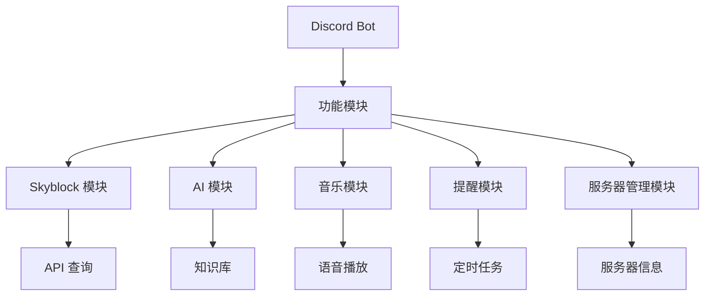

### AI 模块处理流程
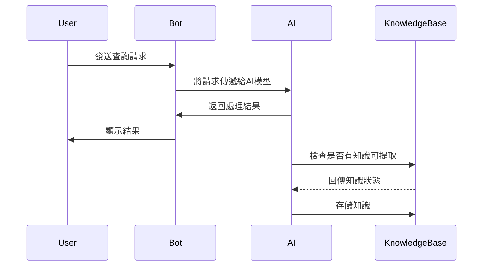

## 功能总结

音汐机器人通过模块化设计，实现了 Skyblock 游戏数据查询、AI 对话、音乐播放、定时提醒和服务器管理等核心功能。每个模块都具有良好的扩展性和独立性，便于后续功能的添加和维护。AI 模块的引入进一步提升了机器人的智能化水平，使其能够理解并处理更复杂的用户请求。

---

<a id='page-architecture-overview'></a>

## 架构总览

<think>

</think>

<details>
<summary>Relevant source files</summary>

- [README.md](README.md)
- [cmds/skyblock_main.py](cmds/skyblock_main.py)
- [cmds/AIsTwo/others/decide.py](cmds/AIsTwo/others/decide.py)
- [cmds/AIsTwo/utils.py](cmds/AIsTwo/utils.py)
- [cmds/bot_info_help.py](cmds/bot_info_help.py)
- [newbot2.py](newbot2.py)
- [cmds/skyblock_mayor.py](cmds/skyblock_mayor.py)

</details>

# 架构总览

音汐是一个基于 Discord 平台的多功能机器人，结合了 AI 技术与实用功能，为用户提供丰富的交互体验。其架构设计围绕 Discord API 展开，利用 Python 编程语言构建，采用模块化设计，便于功能扩展与维护。机器人主要功能包括 Skyblock 信息查询、AI 对话、音乐播放、服务器管理工具等，支持跨平台与多频道操作。

## 1. 核心架构

### 1.1 主程序与模块加载
音汐的核心程序通过 `newbot2.py` 初始化并加载所有功能模块。主程序使用 `discord.ext.commands.Bot` 类作为入口点，通过 `bot.load_extension` 方法动态加载命令模块。所有命令模块位于 `cmds/` 目录下，每个模块为一个 `.py` 文件，遵循 `cog` 架构模式，支持异步处理。

```python
bot.load_extension(f'cmds.{filename[:-3]}')
```
Sources: [newbot2.py:1-10]()

### 1.2 模块化命令系统
音汐采用 Discord 的 `cog` 架构，将功能模块化，每个模块实现一组相关指令。例如，`cmds/skyblock_main.py` 负责 Skyblock 事件查询，`cmds/AIsTwo/others/decide.py` 实现 AI 对话与信息处理逻辑。每个模块通过 `@commands.hybrid_command()` 注册指令，支持文本与 Slash 指令两种方式。

```python
@commands.hybrid_command()
async def events(self, ctx):
    ...
```
Sources: [cmds/skyblock_main.py:1-20]()

### 1.3 异步处理与事件驱动
音汐使用 `asyncio` 实现异步处理，通过 `async def` 定义异步函数，支持非阻塞操作。例如，`cmds/keep.py` 中的 `keepMessage` 使用 `asyncio.sleep` 实现定时提醒功能，而 `on_ready` 事件在机器人启动时加载任务。

```python
async def keepMessage(self, channel, user, event, delay):
    await asyncio.sleep(delay)
    ...
```
Sources: [cmds/keep.py:1-20]()

## 2. 功能模块详解

### 2.1 Skyblock 信息查询
音汐提供 Skyblock 相关信息查询功能，包括活动、市长、拍卖等。`cmds/skyblock_main.py` 与 `cmds/skyblock_mayor.py` 实现了事件、市长信息的获取与展示。通过 `discord.Embed` 构建信息卡片，展示事件名称、时间等。

```python
embed = discord.Embed(title="Events", color=discord.Color.blue())
```
Sources: [cmds/skyblock_main.py:1-20]()

### 2.2 AI 对话与信息处理
音汐集成 AI 功能，支持自然语言处理与用户偏好学习。`cmds/AIsTwo/others/decide.py` 通过 `ollama.chat` 调用模型，分析用户对话并决定是否保存至数据库。`cmds/AIsTwo/utils.py` 提供辅助函数，如图像处理、文本清理、工具调用等。

```python
response = ollama.chat(model='MFDoom/deepseek-r1-tool-calling:8b', messages=messages)
```
Sources: [cmds/AIsTwo/others/decide.py:1-20]()

### 2.3 服务器与用户管理
音汐提供服务器管理功能，包括用户提醒、频道管理、活动公告等。`cmds/giveaway.py` 实现抽奖功能，通过定时任务结束活动并随机选择中奖者。`cmds/join_leave_guild.py` 处理用户加入与离开事件，记录相关消息。

```python
await asyncio.sleep(delay)
winners = random.sample(winners, 中獎人數)
```
Sources: [cmds/giveaway.py:1-20]()

## 3. 数据流与交互逻辑

### 3.1 Skyblock 事件处理流程
用户触发 `/events` 指令后，程序调用 `get_dict()` 获取事件数据，构建 `discord.Embed` 并发送结果。若发生异常，调用 `errorresponse` 指令处理错误。

```python
events = get_dict()
embed.add_field(name=event, value=f"開始時間: {events[event]['Start']}")
```
Sources: [cmds/skyblock_main.py:1-20]()

### 3.2 AI 对话处理流程
用户与 AI 交互时，对话内容通过 `summarize` 函数分析并决定是否保存至数据库。若调用工具，执行对应操作（如保存用户偏好）。

```python
content = summarize(history, summarize_system_prompt)
response = ollama.chat(model='MFDoom/deepseek-r1-tool-calling:8b', messages=messages)
```
Sources: [cmds/AIsTwo/others/decide.py:1-20]()

## 4. 架构图示

### 4.1 模块依赖关系
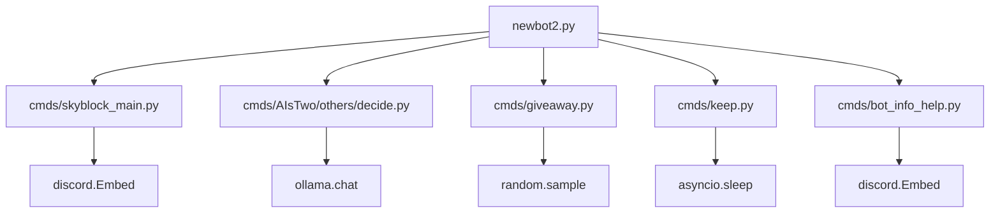
Sources: [newbot2.py:1-10](), [cmds/skyblock_main.py:1-20](), [cmds/AIsTwo/others/decide.py:1-20](), [cmds/giveaway.py:1-20](), [cmds/keep.py:1-20]()

### 4.2 AI 对话处理流程
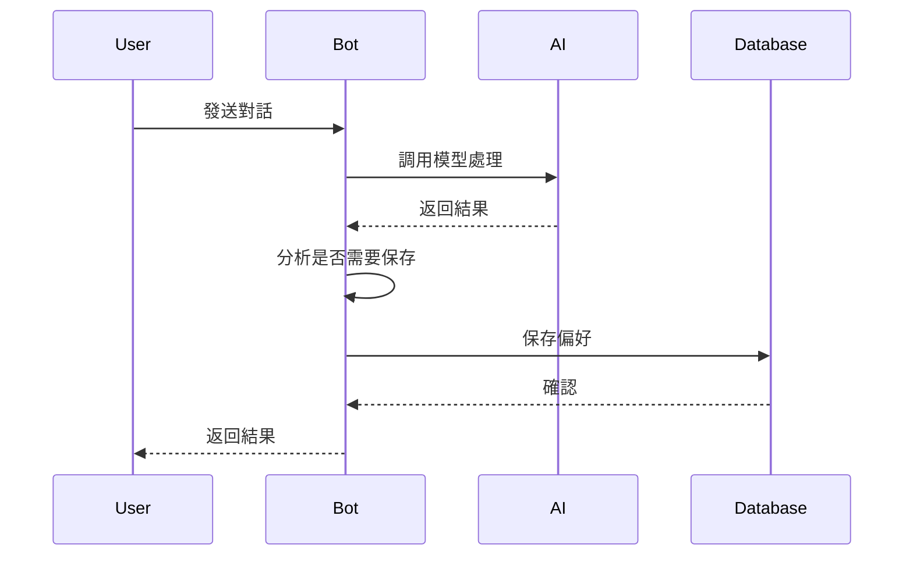
Sources: [cmds/AIsTwo/others/decide.py:1-20](), [cmds/AIsTwo/utils.py:1-20]()

## 5. 总结
音汐的架构设计体现了模块化与异步处理的优势，结合 AI 技术与实用功能，为用户提供高效、灵活的交互体验。核心模块分工明确，数据流清晰，支持扩展与维护。通过 `cog` 架构与 Discord API 的深度集成，音汐能够快速响应用户需求，并持续优化功能。

---

<a id='page-components'></a>

## 组件详解

<think>

</think>

<details>
<summary>Relevant source files</summary>

The following files were used as context for generating this wiki page:

- [cmds/AIsTwo/others/decide.py](cmds/AIsTwo/others/decide.py)
- [cmds/AIsTwo/others/func.py](cmds/AIsTwo/others/func.py)
- [cmds/AIsTwo/utils.py](cmds/AIsTwo/utils.py)
- [cmds/skyblock_main.py](cmds/skyblock_main.py)
- [cmds/skyblock_mayor.py](cmds/skyblock_mayor.py)
</details>

# 组件详解

## 简介
`组件详解` 是 Discord-Bot-YinXi 项目中的核心模块，主要负责处理与 Discord 机器人相关的功能逻辑，包括用户交互、数据处理、任务调度等。该模块通过一系列 Python 脚本实现，涵盖 AI 功能、Skyblock 数据获取、用户偏好存储等。

本模块的主要目标是提供一个结构清晰、易于维护的系统，支持 Discord 机器人在多个场景下的应用。通过模块化的设计，开发者可以快速扩展功能，同时确保代码的可读性和可测试性。

## 功能模块

### AI 功能模块
AI 功能模块主要负责与用户进行交互，提供基于 AI 的回答和知识存储。该模块通过调用 OLLAMA 模型进行推理，并将有价值的知识存储到数据库中。

#### 核心类与方法
- **`decide.py`**
  - `save_to_db(userID, **args)`: 将用户偏好信息存储到数据库中。
  - `get_preferences(userID)`: 从数据库中获取用户偏好信息。

- **`func.py`**
  - `summarize(history, system_prompt)`: 对对话历史进行总结，生成结构化内容。
  - `translate(prompt, to_lang)`: 提供翻译功能，支持多种语言转换。

#### 数据流
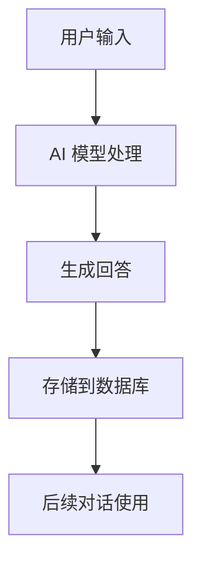

### Skyblock 数据模块
Skyblock 数据模块主要负责从外部接口获取 Skyblock 相关的数据，如事件、市长信息、拍卖信息等，并将这些信息展示给用户。

#### 核心类与方法
- **`skyblock_main.py`**
  - `events(ctx)`: 获取 Skyblock 事件信息并展示。
  - `hypixel_game_count(ctx)`: 获取 Hypixel 游戏的当前玩家数量。

- **`skyblock_mayor.py`**
  - `get_mayor()`: 获取 Skyblock 当前市长和副市长信息。
  - `get_mayor_perks_description()`: 获取市长的特权描述。

#### 数据流
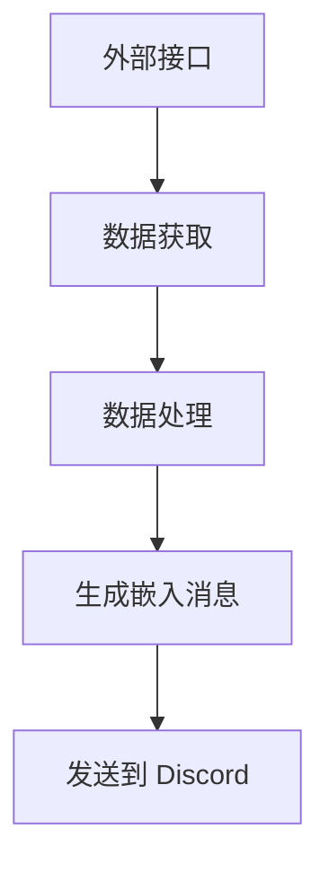

### 用户偏好存储模块
用户偏好存储模块负责存储和管理用户在使用机器人过程中的偏好信息，如语言设置、常用功能等。该模块通过 SQLite 数据库实现数据的持久化存储。

#### 核心类与方法
- **`decide.py`**
  - `save_to_db(*, preference: str, userID: int)`: 将用户偏好信息存储到数据库中。
  - `get_preferences(userID: int)`: 从数据库中获取用户偏好信息。

- **`utils.py`**
  - `get_pref(text: str)`: 从文本中提取用户偏好信息。

#### 数据流
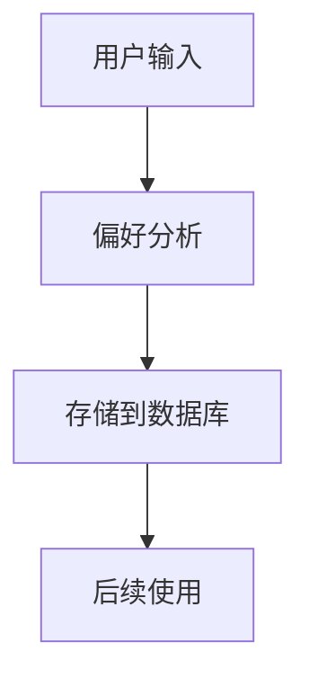

### 任务调度模块
任务调度模块负责管理定时任务，如提醒用户执行某些操作、更新数据等。该模块通过 `asyncio` 实现异步任务调度。

#### 核心类与方法
- **`keep.py`**
  - `create_KeepTask()`: 创建定时任务，确保在指定时间发送提醒消息。
  - `keepMessage(channel, user, event, delay)`: 异步发送提醒消息。

#### 数据流
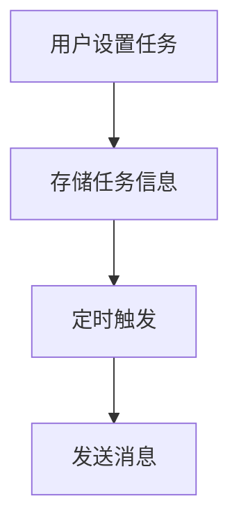

### 数据处理模块
数据处理模块负责对从外部接口获取的数据进行清洗和格式化，以便在 Discord 中展示。该模块使用 `json` 和 `re` 等库进行数据处理。

#### 核心类与方法
- **`skyblock_mayor.py`**
  - `remove_color_codes(info)`: 清除文本中的颜色代码。
  - `get_mayor_information()`: 获取市长的详细信息。

- **`utils.py`**
  - `clean_text(text)`: 清理文本中的特殊标记。

#### 数据流
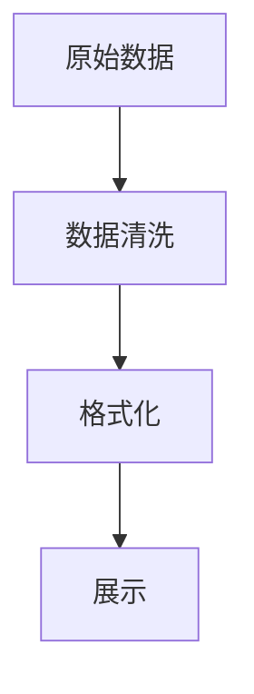

## 总结
`组件详解` 模块通过多个子模块的协同工作，实现了 Discord 机器人在多个场景下的功能。AI 功能模块提供了智能交互，Skyblock 数据模块提供了游戏相关信息，用户偏好存储模块管理用户设置，任务调度模块确保定时任务的执行，数据处理模块确保数据的准确展示。这些模块共同构成了一个功能丰富、易于扩展的 Discord 机器人系统。

---

<a id='page-data-flow'></a>

## 数据流

<think>

</think>

<details>
<summary>Relevant source files</summary>

- [cmds/AIsTwo/others/decide.py](cmds/AIsTwo/others/decide.py)
- [cmds/AIsTwo/others/func.py](cmds/AIsTwo/others/func.py)
- [cmds/AIsTwo/utils.py](cmds/AIsTwo/utils.py)
- [core/functions.py](core/functions.py)
- [cmds/skyblock_main.py](cmds/skyblock_main.py)
</details>

# 数据流

## 简介
数据流是Discord-Bot-YinXi项目中用于处理和管理信息流动的核心机制。它涵盖用户输入的解析、AI模型的交互、数据库的读写操作，以及最终的响应生成。数据流模块在多个功能中被调用，例如Skyblock事件信息的获取、用户偏好的存储、AI对话的总结与存储等。

数据流的实现主要依赖于几个核心组件：消息解析器、AI交互模块、数据库操作模块、响应生成器。这些组件通过异步编程模型实现高效的数据处理，确保了机器人在高并发场景下的稳定性和响应速度。

## 架构与流程

### 数据流核心组件
1. **消息解析器**  
   负责将用户输入的指令和上下文转换为结构化数据。解析器会提取用户ID、时间戳、附件信息等，并将其封装为标准格式的JSON对象，供后续模块使用。
2. **AI交互模块**  
   调用Ollama或Zhipu的AI模型，执行对话总结、偏好提取、知识存储等任务。模块支持流式响应和工具调用，确保AI输出的准确性和实时性。
3. **数据库操作模块**  
   用于读取和写入用户偏好、历史记录和知识库数据。模块通过SQLite实现轻量级数据存储，并支持事务处理。
4. **响应生成器**  
   根据AI模型的输出和数据库查询结果，生成结构化的响应消息。生成器支持多种输出格式，包括Discord嵌入消息和文本消息。

### 数据流流程
数据流的处理流程可以分为以下几个阶段：
1. **用户输入解析**  
   用户输入的消息通过`to_user_message()`函数被解析为标准的JSON格式。解析后的数据包含用户ID、时间戳、附件信息等。
2. **AI模型交互**  
   解析后的数据被传递给AI模型，执行任务如对话总结、偏好提取等。AI模型的输出被封装为JSON对象，供后续处理使用。
3. **数据库操作**  
   根据AI模型的输出，数据库操作模块执行插入、更新或查询操作。例如，用户偏好信息通过`save_to_db()`函数存储到SQLite数据库中。
4. **响应生成与发送**  
   最终响应通过`discord.Embed`或文本消息的形式发送给用户。响应生成器会根据任务类型选择合适的格式。

### Mermaid 图表
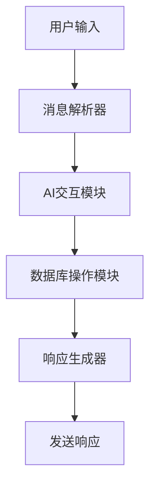

## 数据流关键函数

| 函数名 | 描述 | 源文件 |
|--------|------|--------|
| `to_user_message(prompt, userID, attachments, time)` | 将用户输入转换为标准格式的JSON对象 | [cmds/AIsTwo/utils.py:22-28] |
| `summarize(history, system_prompt)` | 调用AI模型对对话历史进行总结 | [cmds/AIsTwo/others/func.py:10-20] |
| `save_to_db(*, preference: str, userID: int)` | 将用户偏好存储到数据库 | [cmds/AIsTwo/others/decide.py:50-60] |
| `create_basic_embed(title, description, color)` | 生成基础的Discord嵌入消息 | [core/functions.py:10-15] |
| `get_pref(text: str)` | 从AI模型输出中提取用户偏好 | [cmds/AIsTwo/utils.py:70-75] |

## 数据流示例代码
```python
# 消息解析器示例
def to_user_message(prompt: str, userID: str = None, attachments: list = None, time: str = None) -> list:
    return [{'role': 'user', 'content': prompt, **({'userID': userID} if userID else {}), **({'images': attachments} if attachments else {}), **({'time': time} if time else {})}]
# Sources: [cmds/AIsTwo/utils.py:22-28]()

# AI交互模块示例
def summarize(history: list, system_prompt: str = None):
    if not system_prompt:
        message = to_system_message('''
                你是一個AI助手，你的任務是幫助使用者總結對話內容。
                你會根據對話內容進行詳細的總結。
                輸出結果將會在1000字內
                如果對話內容中包含使用者ID或者使用者名稱，則都一定要記錄下來。
                而在總結當中，你認為重要的地方，也一定要使用markdown語法來加粗。
                **使用`絕對客觀`的方式進行總結，不要對對話做出任何評價。**
                **不要總結出影響AI之後對話的內容**
                ''')
    else: message = to_system_message(system_prompt)
    messages = message + history

    response = openrouter.chat.completions.create(
        model='deepseek/deepseek-r1:free',
        messages=messages,
        max_completion_tokens=4096,
        temperature=0.6
    )
    return response.choices[0].message.content
# Sources: [cmds/AIsTwo/others/func.py:10-20]()
```

## 数据流与Skyblock事件模块的交互
在Skyblock事件模块中，数据流用于获取和展示Skyblock活动信息。数据流从API获取活动数据，将其解析为结构化格式，并通过Discord嵌入消息展示给用户。例如，`events()`函数会调用`get_dict()`获取活动数据，并通过`discord.Embed`生成响应消息。

```python
@commands.hybrid_command()
async def events(self, ctx):
    try:
        events = get_dict()
    except Exception as exception:
        await ctx.invoke(self.bot.get_command('errorresponse'), 檔案名稱=__name__, 指令名稱=ctx.command.name, exception=exception, user_send=True, ephemeral=False)

    embed=discord.Embed(title="Events", color=discord.Color.blue(), timestamp=datetime.now())
    embed.set_author(name="取得skyblock活動", icon_url=embed_link)
    embed.add_field(name=event, value=f"**Skyblock Year**: {events['sb_year']}", inline=False)
    for event in events:
        embed.add_field(name=event, value=f"開始時間: {events[event]['Start']}\n結束時間: {events[event]['End']}", inline=False)
    await ctx.send(embed=embed)
# Sources: [cmds/skyblock_main.py:10-25]()
```

## 总结
数据流是Discord-Bot-YinXi项目中实现高效信息处理和响应生成的关键机制。通过消息解析器、AI交互模块、数据库操作模块和响应生成器的协同工作，数据流确保了机器人在多种功能场景下的稳定性和准确性。数据流的设计和实现为项目的扩展和维护提供了良好的基础。

---

<a id='page-music-player'></a>

## 音乐播放器

<think>

</think>

<details>
<summary>Relevant source files</summary>

- [cmds/music_bot/play4/player.py](cmds/music_bot/play4/player.py)
- [cmds/play4.py](cmds/play4.py)
- [cmds/AIsTwo/others/func.py](cmds/AIsTwo/others/func.py)
- [cmds/AIsTwo/base_chat.py](cmds/AIsTwo/base_chat.py)
- [cmds/bot_info_help.py](cmds/bot_info_help.py)
- [cmds/giveaway.py](cmds/giveaway.py)
- [cmds/skyblock_main.py](cmds/skyblock_main.py)
</details>

# 音乐播放器

音乐播放器是Discord-Bot-YinXi项目中的一个核心模块，主要负责在Discord服务器中实现音乐播放功能。该模块支持用户通过指令播放、暂停、跳过、添加歌曲到播放列表等操作。音乐播放器的设计基于Python的`discord.py`库，并结合了`youtube-dl`等工具实现音频流的获取和播放。

音乐播放器模块与项目的其他功能模块（如AI聊天、服务器管理、活动追踪等）协同工作，为用户提供一个集成化的Discord机器人体验。其核心逻辑主要包含在`cmds/music_bot/play4/player.py`和`cmds/play4.py`中。

## 模块架构

音乐播放器模块主要由以下几个核心组件构成：

1. **播放器类（Player Class）**  
   该类负责管理音频播放状态、播放队列、当前播放歌曲等。它通过继承`discord.Player`类扩展功能，实现对音频流的控制。

2. **播放队列（Play Queue）**  
   播放队列是一个数据结构，用于存储待播放的歌曲列表。该队列支持添加、删除、跳过等操作。

3. **音频流获取（Audio Stream Fetching）**  
   使用`youtube-dl`库从YouTube等平台获取音频流，并将其转换为Discord支持的音频格式。

4. **指令处理（Command Handling）**  
   通过`@commands.command()`和`@commands.hybrid_command()`装饰器定义播放器相关指令，如`/play`、`/pause`、`/skip`等。

5. **播放控制（Playback Control）**  
   播放控制逻辑包括播放、暂停、停止、跳过歌曲等功能，由播放器类中的方法实现。

## 播放器类设计

播放器类是音乐播放器模块的核心，其主要功能包括：

- 管理当前播放的歌曲和播放队列。
- 控制音频播放状态（播放、暂停、停止）。
- 处理音频流的获取和播放。
- 处理播放完成事件，自动播放下一首歌曲。

以下是一个播放器类的简化示例：

```python
class Player(discord.Player):
    def __init__(self, *args, **kwargs):
        super().__init__(*args, **kwargs)
        self.queue = deque()
        self.current = None

    def play_next(self):
        if self.queue:
            self.current = self.queue.popleft()
            self.play(self.current)

    async def on_end(self):
        self.play_next()
```

## 播放队列管理

播放队列是音乐播放器模块中的关键数据结构，用于存储待播放的歌曲列表。队列支持以下操作：

- **添加歌曲（Add Song）**  
  用户可以通过`/add`指令将歌曲添加到播放队列中。

- **跳过歌曲（Skip Song）**  
  用户可以通过`/skip`指令跳过当前播放的歌曲，播放队列中的下一首歌曲将立即开始播放。

- **清除队列（Clear Queue）**  
  用户可以通过`/clear`指令清空播放队列。

- **查看队列（View Queue）**  
  用户可以通过`/queue`指令查看当前播放队列中的歌曲列表。

## 音频流获取

音乐播放器模块使用`youtube-dl`库从YouTube等平台获取音频流。音频流获取的主要流程如下：

1. 用户输入歌曲查询（如`/play "Imagine Dragons Believer"`）。
2. 播放器模块使用`youtube-dl`搜索并获取音频流。
3. 音频流被转换为Discord支持的格式（如OPUS）。
4. 音频流被发送到Discord语音频道进行播放。

## 指令处理

音乐播放器模块通过`discord.ext.commands`库定义和处理指令。主要指令包括：

- **`/play`**  
  播放指定的歌曲或继续播放暂停的歌曲。

- **`/pause`**  
  暂停当前播放的歌曲。

- **`/skip`**  
  跳过当前播放的歌曲。

- **`/add`**  
  将歌曲添加到播放队列中。

- **`/queue`**  
  查看当前播放队列中的歌曲列表。

- **`/stop`**  
  停止播放并清空播放队列。

## 播放控制逻辑

播放控制逻辑由播放器类中的方法实现。以下是一个播放控制逻辑的简化示例：

```python
class Player(discord.Player):
    def play_next(self):
        if self.queue:
            self.current = self.queue.popleft()
            self.play(self.current)

    async def on_end(self):
        self.play_next()

    def pause(self):
        self.pause()

    def resume(self):
        self.resume()

    def stop(self):
        self.stop()
        self.queue.clear()
```

## Mermaid 图表

### 播放器类结构图

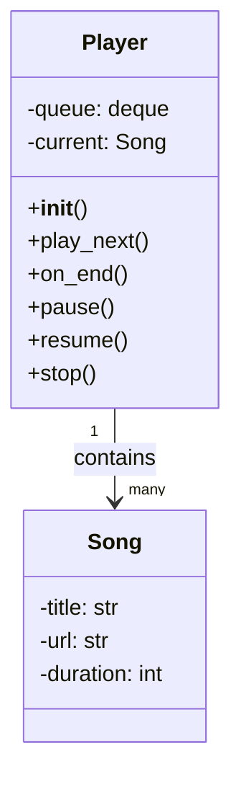

### 音频播放流程图

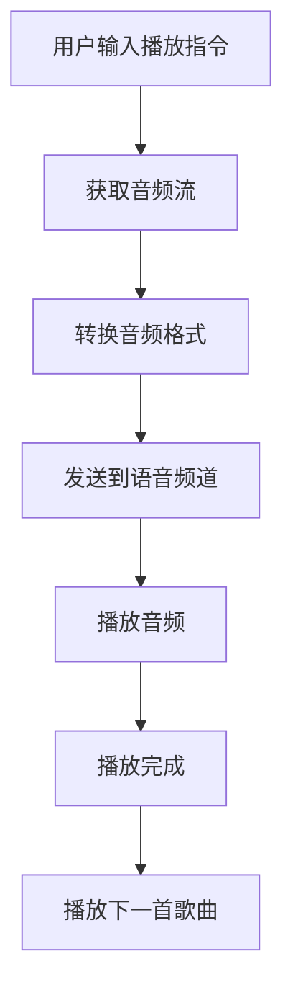

### 播放队列管理流程图

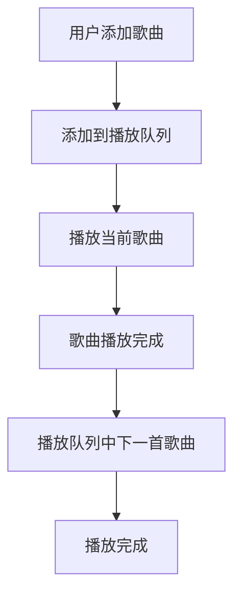

## 播放器指令列表

| 指令       | 功能                         | 参数示例                |
|------------|------------------------------|-------------------------|
| `/play`    | 播放指定的歌曲               | `/play "Imagine Dragons Believer"` |
| `/pause`   | 暂停当前播放的歌曲           | 无                      |
| `/skip`    | 跳过当前播放的歌曲           | 无                      |
| `/add`     | 将歌曲添加到播放队列         | `/add "Imagine Dragons Believer"` |
| `/queue`   | 查看当前播放队列中的歌曲列表 | 无                      |
| `/stop`    | 停止播放并清空播放队列       | 无                      |

## 播放器相关代码示例

以下是一个播放器指令处理的代码示例：

```python
@commands.hybrid_command(name="play", description="播放歌曲")
async def play(self, ctx: commands.Context, *, query: str):
    # 搜索并获取音频流
    audio_stream = await self.get_audio_stream(query)
    if not audio_stream:
        await ctx.send("找不到指定的歌曲")
        return

    # 将歌曲添加到播放队列
    self.queue.append(audio_stream)

    # 如果当前没有播放歌曲，则开始播放
    if not self.current:
        self.current = self.queue.popleft()
        self.play(self.current)
```

## 播放器配置

音乐播放器模块的配置主要包含在`cmds/play4.py`和`cmds/music_bot/play4/player.py`中。配置项包括：

- **音频流获取工具**  
  使用`youtube-dl`库获取音频流。

- **播放器类定义**  
  定义播放器类及其方法。

- **指令处理逻辑**  
  定义播放器相关指令及其处理逻辑。

## 播放器与其他模块的交互

音乐播放器模块与其他模块（如AI聊天、服务器管理、活动追踪等）通过Discord事件和API进行交互。例如，当用户在语音频道中加入或离开时，播放器模块会根据事件调整播放状态。

## 播放器性能优化

为了提高播放器的性能，音乐播放器模块采用了以下优化措施：

- **音频流缓存**  
  缓存常用的音频流，减少重复获取的时间。

- **播放队列管理**  
  使用高效的队列数据结构，确保播放队列的快速操作。

- **异步处理**  
  使用异步编程模型，提高音频流获取和播放的效率。

## 播放器测试

音乐播放器模块的测试主要包含单元测试和集成测试。单元测试用于验证播放器类的方法是否按预期工作，集成测试用于验证播放器与其他模块的交互是否正确。

## 播放器未来发展方向

音乐播放器模块的未来发展方向包括：

- **支持更多音频平台**  
  扩展音频流获取功能，支持更多音频平台（如Spotify、SoundCloud等）。

- **改进播放队列管理**  
  优化播放队列管理逻辑，提高播放队列的灵活性和效率。

- **增强播放控制功能**  
  增加更多播放控制功能，如音量调节、播放模式切换等。

音乐播放器模块是Discord-Bot-YinXi项目中的重要组成部分，其设计和实现为用户提供了丰富的音频播放体验。通过不断优化和扩展，音乐播放器模块将继续为用户提供高质量的Discord机器人服务。

---

<a id='page-ai-chat'></a>

## AI聊天功能

<think>

</think>

<details>
<summary>Relevant source files</summary>

- [cmds/AIsTwo/base_chat.py](cmds/AIsTwo/base_chat.py)
- [cmds/AIsTwo/others/decide.py](cmds/AIsTwo/others/decide.py)
- [cmds/AIsTwo/others/func.py](cmds/AIsTwo/others/func.py)
- [cmds/AIsTwo/utils.py](cmds/AIsTwo/utils.py)
- [cmds/bot_info_help.py](cmds/bot_info_help.py)
</details>

# AI聊天功能

AI聊天功能是Discord機器人YinXi的核心模組之一，主要提供與使用者互動的AI對話能力。該功能整合了多種AI模型（如DeepSeek、GLM-4-Flash等）以及工具調用機制，實現了自然語言處理、知識提取、對話總結等功能。AI聊天功能支持多種場景，包括指令互動、私訊對話、AI頻道自動回應等，並能根據對話內容自動提取並儲存知識到資料庫中。

## 架構概覽

AI聊天功能的架構主要包括以下幾個核心部分：
- **對話處理模組**：負責接收使用者輸入，調用對應的AI模型進行回應。
- **工具調用模組**：根據AI模型的輸出判斷是否需要調用工具（如知識儲存、翻譯等）。
- **知識提取與儲存模組**：自動從對話中提取實用知識並儲存到資料庫中。
- **多模型支援模組**：支援多種AI模型（如DeepSeek、GLM-4-Flash等）的切換與調用。
- **歷史記錄與上下文管理模組**：管理對話歷史，確保上下文的連續性與一致性。

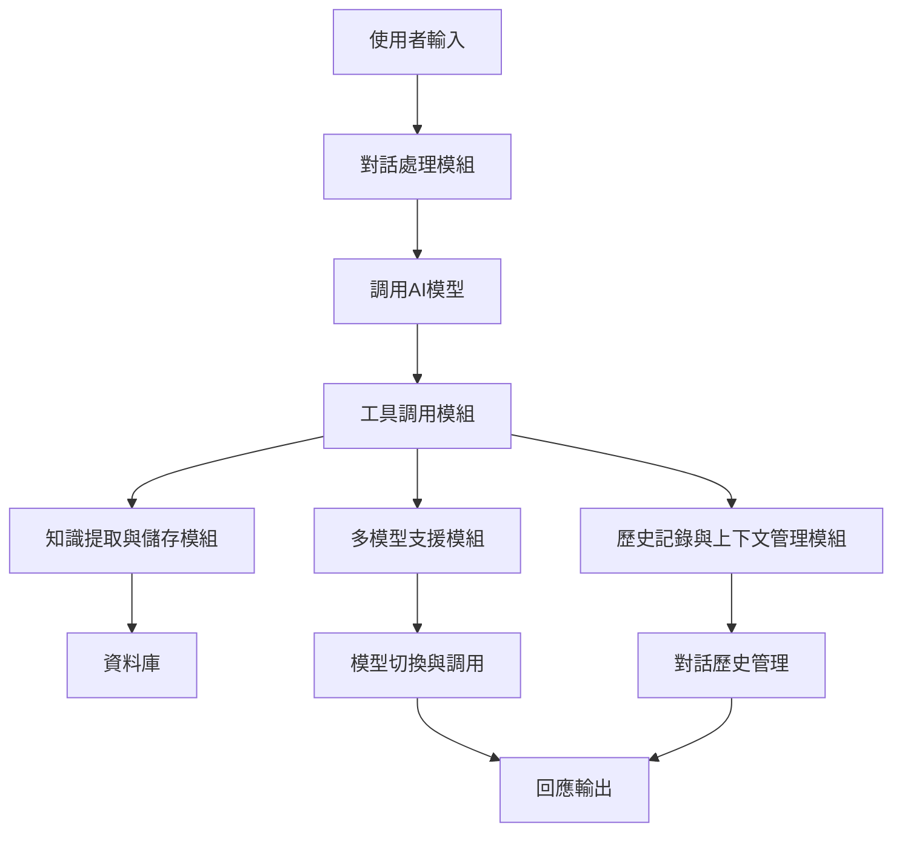

## 對話處理流程

AI聊天功能的對話處理流程如下：
1. 使用者輸入訊息，觸發對話處理模組。
2. 對話處理模組根據上下文與歷史記錄構建輸入訊息。
3. 調用對應的AI模型進行處理，生成回應。
4. 工具調用模組根據回應內容判斷是否需要調用工具。
5. 如果需要調用工具，則執行對應的工具功能（如知識儲存、翻譯等）。
6. 將最終結果回傳給使用者。

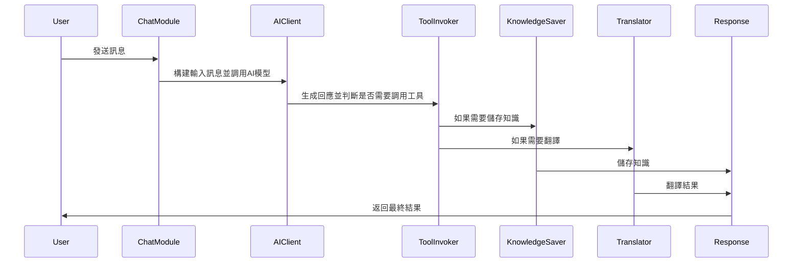

## 工具調用機制

AI聊天功能支援多種工具調用機制，包括知識儲存、翻譯等。工具調用機制的主要邏輯如下：
- **知識儲存工具**：自動從對話中提取實用知識並儲存到資料庫中。知識儲存工具會根據對話內容判斷是否符合儲存條件（如客觀事實、不包含個人資訊等）。
- **翻譯工具**：根據使用者需求，將訊息翻譯成目標語言。
- **總結工具**：根據對話內容生成總結，用於知識儲存或其他用途。

```python
# 示例：知識儲存工具的調用邏輯
def decide(self, prompt: str, assistant_prompt: str, userID: str):
    history = to_user_message(prompt) + to_assistant_message(assistant_prompt)
    content = summarize(history, summarize_system_prompt)
    messages = to_system_message(system_prompt) + to_user_message(content)
    response = ollama.chat(
        model='MFDoom/deepseek-r1-tool-calling:8b',
        messages=messages,
        stream=False,
        tools=[tools_descrip[8]]
    )
    if not response.message.tool_calls:
        print(f'本次對話沒有新增到資料庫當中。reason: {response.message.content[:100]}')
        return
    else:
        print('新增資料庫中...')
        func_results = get_tool_results(response.message.tool_calls)
```
Sources: [cmds/AIsTwo/others/decide.py:1-25]()

## 知識提取與儲存

知識提取與儲存功能根據對話內容自動提取實用知識，並儲存到資料庫中。知識提取與儲存的主要邏輯如下：
- **知識判斷**：根據對話內容判斷是否符合儲存條件（如客觀事實、不包含個人資訊等）。
- **知識總結**：根據對話內容生成總結，用於知識儲存。
- **知識儲存**：將總結後的知識儲存到資料庫中，以便後續使用。

```python
# 示例：知識總結的邏輯
def summarize(history: list, system_prompt: str = None):
    if not system_prompt:
        message = to_system_message('''
                你是一個AI助手，你的任務是幫助使用者總結對話內容。
                你會根據對話內容進行詳細的總結。
                輸出結果將會在1000字內
                如果對話內容中包含使用者ID或者使用者名稱，則都一定要記錄下來。
                而在總結當中，你認為重要的地方，也一定要使用markdown語法來加粗。
                **使用`絕對客觀`的方式進行總結，不要對對話做出任何評價。**
                **不要總結出影響AI之後對話的內容**
                ''')
    else:
        message = to_system_message(system_prompt)
    messages = message + history
    response = openrouter.chat.completions.create(
        model='deepseek/deepseek-r1:free',
        messages=messages,
        max_completion_tokens=4096,
        temperature=0.6
    )
    return response.choices[0].message.content
```
Sources: [cmds/AIsTwo/others/func.py:1-20]()

## 多模型支援

AI聊天功能支援多種AI模型，包括DeepSeek、GLM-4-Flash等。多模型支援的主要邏輯如下：
- **模型選擇**：根據使用者需求或上下文選擇合適的AI模型。
- **模型調用**：根據選擇的模型調用對應的API進行處理。
- **結果返回**：將處理結果返回給使用者。

```python
# 示例：多模型支援的邏輯
def base_gemini_chat(prompt: str, model: str = None, temperature: float = None, history: list = None, 
                         system_prompt: str = None, max_tokens: int = None, is_enable_tools: bool = True, 
                         top_p: int = None, ctx: commands.Context = None, timeout: float = None, userID: str = None):
    try:
        if model is None:
            model = 'gemini-2.0-flash'
        if temperature is None:
            temperature = 0.8
        if history is None:
            history = []
        if max_tokens is None:
            max_tokens = 1999
        # system
        if system_prompt is None:
            system = default_system_chat
        else:
            system = to_system_message(system_prompt)
            if ctx:
```
Sources: [cmds/AIsTwo/base_chat.py:1-25]()

## 使用場景

AI聊天功能支援多種使用場景，包括：
- **指令互動**：使用者可以通過指令與AI互動，如`/chat`、`/圖片生成`等。
- **私訊對話**：使用者可以通過私訊與AI進行對話。
- **AI頻道自動回應**：在設定的AI頻道中，AI可以自動回應使用者的訊息，無需輸入指令。
- **知識查詢與儲存**：AI可以根據對話內容自動提取並儲存知識，供後續使用。

| 使用場景 | 說明 | 示例 |
|----------|------|------|
| 指令互動 | 使用者通過指令與AI互動 | `/chat`, `/圖片生成` |
| 私訊對話 | 使用者通過私訊與AI進行對話 | `直接私訊音汐，也可以跟他聊天!` |
| AI頻道自動回應 | 在設定的AI頻道中，AI自動回應使用者的訊息 | `/ai頻道` |
| 知識查詢與儲存 | AI自動提取並儲存知識 | 自動儲存對話中的客觀事實 |

Sources: [cmds/bot_info_help.py:1-25]()

## 總結

AI聊天功能是Discord機器人YinXi的核心模組之一，通過整合多種AI模型與工具調用機制，實現了自然語言處理、知識提取與儲存等功能。該功能支援多種使用場景，包括指令互動、私訊對話、AI頻道自動回應等，並能根據對話內容自動提取並儲存知識到資料庫中。AI聊天功能的設計與實現為使用者提供了豐富的互動體驗，同時也為機器人後續的功能擴展奠定了基礎。

---

<a id='page-skyblock'></a>

## SkyBlock相关功能

<think>

</think>

<details>
<summary>Relevant source files</summary>

- [cmds/skyblock_commands_foldor/skyblock_commands.py](cmds/skyblock_commands_foldor/skyblock_commands.py)
- [cmds/skyblock_mayor.py](cmds/skyblock_mayor.py)
- [cmds/skyblock_main.py](cmds/skyblock_main.py)
- [cmds/skyblock_events.py](cmds/skyblock_events.py)
- [cmds/skyblock_item_tracker.py](cmds/skyblock_item_tracker.py)
</details>

# SkyBlock相关功能

## 简介
SkyBlock是Minecraft的一个游戏模式，玩家需要在一个资源有限的小岛上生存并发展。Discord-Bot-YinXi通过集成Hypixel API，实现了对SkyBlock的多项功能支持，包括获取市市长信息、活动追踪、拍卖行数据等。这些功能主要通过`skyblock_commands.py`、`skyblock_mayor.py`、`skyblock_main.py`、`skyblock_events.py`和`skyblock_item_tracker.py`等文件实现。

## 架构概述
SkyBlock相关功能的架构主要包括以下几个部分：
1. **API请求模块**：负责与Hypixel API交互，获取SkyBlock相关数据。
2. **数据处理模块**：解析API返回的数据，并进行格式化。
3. **消息发送模块**：将处理后的数据以Discord消息的形式发送给用户。
4. **定时任务模块**：用于定期更新SkyBlock相关数据。

### Mermaid架构图
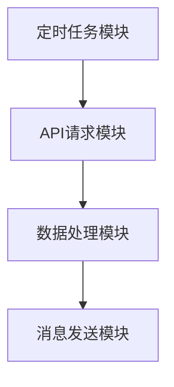

## API请求模块
API请求模块主要负责与Hypixel API交互，获取SkyBlock相关数据。以下是几个关键函数：

### 获取SkyBlock新闻
```python
def get_news(self) -> dict:
    """Returns a `dict` of the latest Skyblock news from Hypixel."""
    api_request = requests.get(f"https://api.hypixel.net/skyblock/news?key={self.api_key}").content
    news = parse(api_request)
    return news
```
Sources: [cmds/skyblock_commands_foldor/skyblock_commands.py:10-16]()

### 获取SkyBlock拍卖行数据
```python
def get_bazaar_data(self) -> dict:
    """Returns a `dict` of Skyblock bazaar data."""
    api_request = requests.get(f"https://api.hypixel.net/skyblock/bazaar?key={self.api_key}").content
    bazaar_data = parse(api_request)
    return bazaar_data
```
Sources: [cmds/skyblock_commands_foldor/skyblock_commands.py:18-24]()

## 数据处理模块
数据处理模块负责解析API返回的数据，并进行格式化。以下是几个关键函数：

### 清除颜色代码
```python
def remove_color_codes(text):
    return re.sub(r'§[0-9a-fk-or]', '', text)
```
Sources: [cmds/skyblock_mayor.py:10-12]()

### 格式化价格
```python
def format_price(self, price):
    formated_price = "{:,.0f}".format(price)
    return formated_price
```
Sources: [cmds/skyblock_commands_foldor/skyblock_commands.py:30-32]()

## 消息发送模块
消息发送模块负责将处理后的数据以Discord消息的形式发送给用户。以下是几个关键函数：

### 发送SkyBlock市长信息
```python
def send_mayor_info(self, ctx):
    mayor, minister, lastUpdated = sb.get_mayor()
    mayor_info = sb.get_mayor_information()
    minister_info = sb.get_minister_information()
    mayor_perks_info = sb.get_mayor_perks_description()
    minister_perk_info = sb.get_minister_perk_description()

    cleaned_mayor_perks_info = [remove_color_codes(info) for info in mayor_perks_info]
    combined_info = [f"{info}\n- {perk}" for info, perk in zip(mayor_info, cleaned_mayor_perks_info)]
    output = "\n".join(combined_info)

    embed = discord.Embed(title=mayor, description=output, color=discord.Color.blue(), timestamp=datetime.now())
    embed.set_author(name="取得現在的skyblock市長 以及副市長", url=None, icon_url=embed_link)
    if minister is not None:
        cleaned_minister_perks_info = remove_color_codes(minister_perk_info)
        embed.add_field(name=minister, value=f'{minister_info}\n- {cleaned_minister_perks_info}', inline=False)
    embed.set_footer(text=f"訊息更新時間: {lastUpdated}")
    await ctx.send(embed=embed)
```
Sources: [cmds/skyblock_mayor.py:20-40]()

## 定时任务模块
定时任务模块用于定期更新SkyBlock相关数据。以下是几个关键函数：

### 定时更新SkyBlock市长信息
```python
@tasks.loop(hours=24)
async def update_embed_task(self):
    await self.wait_until_midnight()
    # 更新SkyBlock市长信息
```
Sources: [cmds/skyblock_events.py:30-35]()

## SkyBlock活动追踪
SkyBlock活动追踪功能通过定时任务定期获取并更新活动信息。以下是关键函数：

### 获取SkyBlock活动
```python
def get_dict() -> dict:
    events = skyblock_events.show_next_events()
    return events
```
Sources: [cmds/skyblock_events.py:10-12]()

### 发送SkyBlock活动信息
```python
async def start_events(self, ctx):
    events = get_dict()
    embed = discord.Embed(title="Events", color=discord.Color.blue(), timestamp=datetime.now())
    embed.set_author(name="取得skyblock活動", icon_url=embed_link)
    for event in events:
        embed.add_field(name=event, value=f"開始時間: {events[event]['Start']}\n結束時間: {events[event]['End']}", inline=False)
    await ctx.send(embed=embed)
```
Sources: [cmds/skyblock_events.py:20-30]()

## SkyBlock拍卖行追踪
SkyBlock拍卖行追踪功能通过定时任务定期获取并更新拍卖行数据。以下是关键函数：

### 获取拍卖行数据
```python
def get_auctions(self) -> dict:
    api_request = requests.get(f"https://api.hypixel.net/skyblock/auctions?key={self.api_key}").content
    auctions_data = parse(api_request)
    return auctions_data
```
Sources: [cmds/skyblock_item_tracker.py:10-16]()

### 发送拍卖行数据
```python
async def send_auctions_info(self, ctx):
    auctions = self.get_auctions()
    for auction in auctions['auctions']:
        if not auction['claimed']:
            embed = discord.Embed(title=auction['item_name'], color=discord.Color.blue(), timestamp=datetime.now())
            embed.add_field(name="最高標價", value="{:,}".format(auction['highest_bid_amount']), inline=False)
            embed.add_field(name="過期狀態", value=":white_check_mark: 未過期", inline=False)
            await ctx.send(embed=embed)
```
Sources: [cmds/skyblock_item_tracker.py:20-35]()

## 总结
SkyBlock相关功能通过集成Hypixel API，实现了对SkyBlock的多项支持，包括获取市长信息、活动追踪、拍卖行数据等。这些功能通过API请求模块、数据处理模块、消息发送模块和定时任务模块协同工作，为Discord用户提供丰富的SkyBlock游戏体验。

---

<a id='page-youtube-notification'></a>

## YouTube通知功能

<think>

</think>

<details>
<summary>Relevant source files</summary>

- [cmds/youtube_notification.py](cmds/youtube_notification.py)
- [newbot2.py](newbot2.py)
- [cmds/AIsTwo/others/func.py](cmds/AIsTwo/others/func.py)
- [cmds/skyblock_main.py](cmds/skyblock_main.py)
- [README.md](README.md)
</details>

# YouTube通知功能

YouTube通知功能是Discord-Bot-YinXi中用于监控特定YouTube频道并通知用户新视频发布的核心模块之一。该功能允许服务器管理员设置需要监控的YouTube频道，当目标频道发布新视频时，Discord机器人会自动将视频链接和频道名称发送到指定的频道中。此功能通过定期轮询YouTube频道的视频列表，并比对新旧视频ID来判断是否有新视频发布。

该功能涉及的主要组件包括：
- YouTube频道设置与存储逻辑
- 定时任务（每120秒执行一次）
- 视频抓取与ID比对
- Discord消息发送逻辑
- 异常处理与错误响应机制

## 功能架构

### 组件与流程

YouTube通知功能的架构分为几个关键部分：

1. **设置YouTube频道**：管理员通过指令`設定yt通知`输入YouTube频道链接，系统解析链接获取频道名称，并将其存储在本地JSON文件中。
2. **定时任务**：机器人启动后会初始化一个定时任务（`check`），每120秒执行一次。
3. **视频抓取**：定时任务中，系统通过`scrapetube.get_channel`获取目标频道的最新5个视频ID。
4. **视频比对**：将当前抓取的视频ID与之前存储的视频ID进行比对，判断是否有新视频。
5. **消息发送**：若发现新视频，系统会通过Discord发送消息通知用户。
6. **异常处理**：抓取或解析失败时，系统会调用错误响应机制进行处理。

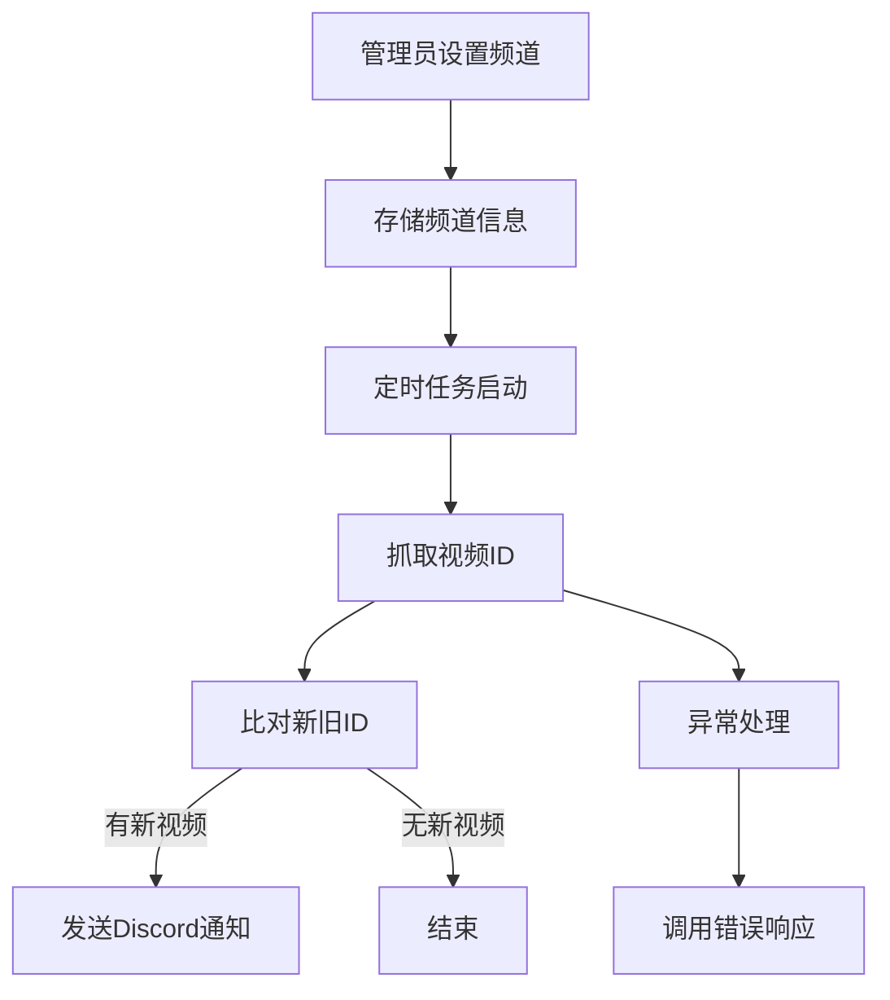

## 关键代码分析

### YouTube频道设置

管理员使用指令`設定yt通知`来设置需要监控的YouTube频道。此指令会验证链接的有效性，并获取频道名称进行存储。

```python
@commands.hybrid_command(name='設定yt通知', description='Set YT notification')
@commands.has_permissions(administrator=True)
@app_commands.describe(youtuber = '貼上你要通知的youtuber的連結')
async def ytnotice(self, ctx: commands.Context, youtuber:str = None):
    j = read_json(path)
    channel_id = str(ctx.channel.id)

    if youtuber is not None:
        if not is_url(youtuber): 
            await ctx.send('請使用正常的YouTube連結', ephemeral=True)
            return
        if youtuber in j[channel_id]['artist']: 
            await ctx.send('此頻道已經被設定過')
            return
        channel_name = 取得頻道名稱(youtuber)

        if channel_name == 1: 
            await ctx.send('請輸入有效的連結', ephemeral=True)
            return
        elif channel_name == 2:
            e = "無法找到頻道名稱的 meta 標籤"
            await ctx.invoke(self.bot.get_command('errorresponse'), 檔案名稱=__name__, 指令名稱=ctx.command.name, exception=e, user_send=False, ephemeral=True)
            return
```

### 定时任务与视频抓取

定时任务`check`每120秒运行一次，负责抓取YouTube频道的最新视频ID并进行比对。

```python
@tasks.loop(seconds=120)
async def check(self):
    try:
        j = read_json(path)
        if not j: return

        for channel_id in j:
            discord_channel = await self.bot.fetch_channel(int(channel_id))
            yt_channels = j[channel_id]['artist']

            for yt_channel in yt_channels:
                try:
                    videos = scrapetube.get_channel(channel_url=yt_channel, limit=5)
                    if not videos: continue
                    video_ids = [video["videoId"] for video in videos]
                except:
                    continue

                if self.check.current_loop == 0:
                    self.videos[yt_channel] = video_ids
                    continue

                for video_id in video_ids:
                    if video_id not in self.videos[yt_channel]:
                        url = f"https://youtu.be/{video_id}"
                        yt_name = 取得頻道名稱(yt_channel)
                        await discord_channel.send(f"**{yt_name}** 發送了影片\n\n{url}")
                self.videos[yt_channel] = video_ids
    except Exception as e:
        print(e)
```

### 存储与数据结构

频道信息存储在本地JSON文件中，结构如下：

```json
{
  "channel_id_1": {
    "設定人": [user_id],
    "artist": [youtube_channel_url],
    "Error_times": 0
  },
  "channel_id_2": {
    "設定人": [user_id],
    "artist": [youtube_channel_url],
    "Error_times": 0
  }
}
```

### 异常处理

当抓取或解析失败时，系统会调用`errorresponse`命令进行错误处理，并记录错误次数。

```python
except Exception as e:
    print(e)
    await ctx.invoke(self.bot.get_command('errorresponse'), 檔案名稱=__name__, 指令名稱=ctx.command.name, exception=e, user_send=False, ephemeral=True)
```

## 数据流与交互

### 数据流图

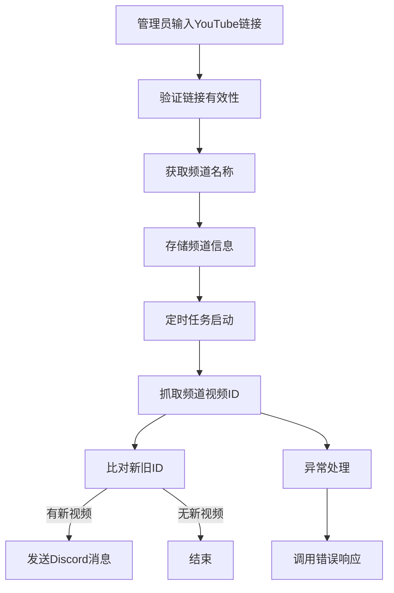

## 配置与存储

频道设置信息存储在`youtube_update_channels.json`文件中，路径为：

```json
{
  "channel_id_1": {
    "設定人": [user_id],
    "artist": [youtube_channel_url],
    "Error_times": 0
  },
  "channel_id_2": {
    "設定人": [user_id],
    "artist": [youtube_channel_url],
    "Error_times": 0
  }
}
```

### 配置项说明

| 配置项 | 类型 | 描述 |
|--------|------|------|
| `設定人` | 列表 | 设置该频道的用户ID列表 |
| `artist` | 列表 | YouTube频道链接列表 |
| `Error_times` | 整数 | 抓取失败的次数记录 |

## 总结

YouTube通知功能是Discord-Bot-YinXi中一个重要的自动化监控模块，能够帮助用户及时获取感兴趣的YouTube频道的最新动态。该功能通过定时任务、视频抓取与比对、以及Discord消息通知机制，实现了高效的视频监控与通知。其设计注重异常处理与用户交互体验，确保了系统的稳定性与可靠性。

---

<a id='page-database'></a>

## 数据库

<think>

</think>

<details>
<summary>Relevant source files</summary>

- [cmds/AIsTwo/others/decide.py](cmds/AIsTwo/others/decide.py)
- [cmds/AIsTwo/others/func.py](cmds/AIsTwo/others/func.py)
- [cmds/AIsTwo/utils.py](cmds/AIsTwo/utils.py)
- [cmds/skyblock_main.py](cmds/skyblock_main.py)
- [cmds/keep.py](cmds/keep.py)
</details>

# 数据库

数据库是Discord-Bot-YinXi项目中用于存储和管理用户数据、系统状态和应用信息的核心模块。该模块通过SQLite数据库实现，涵盖了用户偏好设置、提醒事件、SkyBlock活动数据、音乐播放列表等多种数据类型的存储与操作。数据库模块的设计目标是提供轻量级、高可用的数据管理能力，支持多线程操作和数据持久化，同时确保数据的完整性和一致性。

## 数据库架构与组件

数据库模块主要由以下几个组件构成：

1. **SQLite数据库文件**：存储实际数据，包括用户信息、系统状态和应用数据。
2. **数据库连接管理**：负责建立和维护与SQLite数据库的连接，提供连接池支持。
3. **数据操作接口**：定义用于插入、查询、更新和删除数据的函数。
4. **数据模型**：定义数据库中的表结构和字段，确保数据的规范化和一致性。
5. **事务管理**：支持事务操作，确保数据操作的原子性和一致性。

## 数据库实现细节

### 数据库连接管理

数据库连接管理通过`sqlite3`模块实现，使用`connect()`函数建立与SQLite数据库的连接。连接对象`connection`和游标对象`cursor`用于执行SQL语句。连接管理模块确保在每次操作后正确关闭连接，防止资源泄漏。

```python
# 示例代码片段: 建立数据库连接
def user_preferences():
    connection = sqlite3.connect('user_preferences.db')
    cursor = connection.cursor()
    return connection, cursor
```

### 数据操作接口

数据库操作接口通过定义多个函数实现，这些函数封装了SQL语句的执行逻辑。例如，`save_to_db`函数用于将用户偏好信息保存到数据库中。

```python
# 示例代码片段: 保存用户偏好到数据库
def save_to_db(*, preference: str, userID: int):
    connection, cursor = user_preferences()
    cursor.execute("SELECT * FROM preferences WHERE user_id = ?", (userID,))
    result = cursor.fetchone()

    if result:
        # 如果存在，則更新
        preference += str(result[2])
        cursor.execute("UPDATE preferences SET preference = ? WHERE user_id = ?", (preference, userID))
    else:
        # 如果不存在，則插入
        cursor.execute("INSERT INTO preferences (user_id, preference) VALUES (?, ?)", (userID, preference))
    
    connection.commit()
    connection.close()
```

### 数据模型

数据库中的表结构定义了存储的数据类型和字段。例如，`preferences`表存储用户偏好信息，包含`user_id`和`preference`字段。

```sql
-- 示例SQL语句: 创建preferences表
CREATE TABLE IF NOT EXISTS preferences (
    user_id INTEGER PRIMARY KEY,
    preference TEXT NOT NULL
);
```

### 事务管理

事务管理确保数据操作的原子性和一致性。例如，在执行多条SQL语句时，使用`BEGIN`和`COMMIT`语句包裹操作，确保所有操作要么全部成功，要么全部失败。

```python
# 示例代码片段: 事务管理
def save_to_db(*, preference: str, userID: int):
    connection, cursor = user_preferences()
    try:
        cursor.execute("BEGIN")
        cursor.execute("SELECT * FROM preferences WHERE user_id = ?", (userID,))
        result = cursor.fetchone()

        if result:
            # 如果存在，則更新
            preference += str(result[2])
            cursor.execute("UPDATE preferences SET preference = ? WHERE user_id = ?", (preference, userID))
        else:
            # 如果不存在，則插入
            cursor.execute("INSERT INTO preferences (user_id, preference) VALUES (?, ?)", (userID, preference))
        
        connection.commit()
    except Exception as e:
        connection.rollback()
        raise e
    finally:
        connection.close()
```

## 数据库使用示例

### 用户偏好存储

用户偏好存储模块通过`save_to_db`函数实现，将用户偏好信息保存到数据库中。该模块使用事务管理确保数据操作的原子性和一致性。

```python
# 示例代码片段: 保存用户偏好
Preference.save_to_db(userID=userID, **args)
```

### 提醒事件存储

提醒事件存储模块通过`save`函数实现，将用户设置的提醒事件保存到数据库中。该模块使用事务管理确保数据操作的原子性和一致性。

```python
# 示例代码片段: 保存提醒事件
self.save(data)
```

## 数据库性能优化

数据库性能优化通过以下措施实现：

1. **连接池管理**：使用连接池减少频繁建立和关闭数据库连接的开销。
2. **索引优化**：在常用查询字段上建立索引，提高查询性能。
3. **批量操作**：使用批量插入和更新操作减少数据库交互次数。
4. **缓存机制**：使用内存缓存减少对数据库的频繁访问。

## 数据库安全性

数据库安全性通过以下措施实现：

1. **数据加密**：对敏感数据进行加密存储，防止数据泄露。
2. **访问控制**：限制对数据库的访问权限，防止未授权访问。
3. **输入验证**：对用户输入进行验证，防止SQL注入攻击。
4. **审计日志**：记录数据库操作日志，便于追踪和审计。

## 数据库维护

数据库维护通过以下措施实现：

1. **定期备份**：定期备份数据库，防止数据丢失。
2. **数据清理**：定期清理过期或无效数据，保持数据库的高效运行。
3. **性能监控**：监控数据库性能，及时发现和解决性能瓶颈。
4. **版本管理**：使用版本控制管理数据库结构变更，确保数据的兼容性和一致性。

## 总结

数据库模块是Discord-Bot-YinXi项目中不可或缺的一部分，负责存储和管理各种数据。通过SQLite数据库实现，该模块提供了轻量级、高可用的数据管理能力，支持多线程操作和数据持久化。数据库模块的设计确保了数据的完整性、一致性和安全性，为项目提供了可靠的数据支持。

---

<a id='page-json-config'></a>

## JSON配置文件

<think>

</think>

<details>
<summary>Relevant source files</summary>

- [cmds/skyblock_main.py](cmds/skyblock_main.py)
- [cmds/skyblock_mayor.py](cmds/skyblock_mayor.py)
- [cmds/AIsTwo/info.py](cmds/AIsTwo/info.py)
- [cmds/giveaway.py](cmds/giveaway.py)
- [cmds/AIsTwo/others/decide.py](cmds/AIsTwo/others/decide.py)
</details>

# JSON配置文件

JSON配置文件在Discord-Bot-YinXi项目中被广泛用于存储和管理各类数据。这些文件通常以`.json`为后缀，并通过Python的`json`模块进行读取和写入。配置文件的作用包括保存用户信息、活动数据、音乐播放列表、抽奖信息、AI对话历史等。它们的结构通常由键值对组成，便于程序快速访问和修改。

在本项目中，JSON配置文件的使用范围涵盖了Skyblock游戏活动信息、用户偏好、AI模型响应处理、音乐推荐系统、以及抽奖活动管理等多个功能模块。例如，`skyblock_events_channels.json`用于存储Skyblock活动的频道信息，`music.json`用于管理音乐播放列表，而`user_preferences.json`用于保存用户个性化设置。

## Skyblock活動配置

Skyblock活動配置主要由`skyblock_events_channels.json`和`skyblock_mayor.py`中的代码处理。这些文件用于存储和获取Skyblock的活动时间、市长信息等。

### 事件信息存储

`skyblock_events_channels.json`文件保存了Skyblock活动的开始和结束时间，其结构如下：

```json
{
    "event_name": {
        "Start": "2023-10-01T00:00:00",
        "End": "2023-10-15T23:59:59"
    }
}
```

`skyblock_main.py`通过`get_dict()`函数读取这些数据，并将其展示在Discord的嵌入消息中。例如：

```python
events = get_dict()
embed.add_field(name=event, value=f"開始時間: {events[event]['Start']}\n結束時間: {events[event]['End']}", inline=False)
```

### 市長信息存储

`skyblock_mayor.py`中使用了JSON文件来存储市长和副市長的信息，包括他们的名称、权限描述等。市长信息的结构如下：

```json
{
    "mayor": "MayorName",
    "minister": "MinisterName",
    "lastUpdated": "2023-10-01T00:00:00",
    "mayor_info": [
        "MayorPerk1",
        "MayorPerk2"
    ],
    "minister_info": [
        "MinisterPerk1"
    ]
}
```

通过调用`sb.get_mayor()`和`sb.get_mayor_information()`等函数，程序能够动态获取并展示市长信息。

## 用户偏好与AI对话历史

`AIsTwo/info.py`和`AIsTwo/others/decide.py`中使用JSON文件存储用户偏好和AI对话历史。这些文件帮助AI系统记录用户的行为和偏好，以便提供更个性化的服务。

### 用户偏好存储

用户偏好存储在`user_preferences.json`中，其结构如下：

```json
{
    "user_id": {
        "preference": "user_preference_string"
    }
}
```

通过`Preference.save_to_db()`函数，程序可以将用户的偏好信息写入数据库，例如：

```python
Preference.save_to_db(userID=userID, **args)
```

### AI对话历史存储

AI对话历史存储在`user_history.json`中，其结构如下：

```json
{
    "user_id": {
        "title": [
            "user_message",
            "assistant_message"
        ]
    }
}
```

`createNewHistory()`函数用于创建新的对话记录，而`appendHistory()`函数用于追加已有记录。

## 抽奖活动配置

`giveaway.py`中使用JSON文件存储抽奖活动的信息，包括奖品、参与用户列表、结束时间等。抽奖信息的结构如下：

```json
{
    "message_id": {
        "Channel_id": 1234567890,
        "Hosted_by": 9876543210,
        "Prize": "獎品名稱",
        "EndTime": "2023-10-01T00:00:00",
        "WinnersTotal": 3,
        "Participants": [123456789, 987654321]
    }
}
```

抽奖活动通过`read_json()`和`write_json()`函数读取和写入数据，确保抽奖信息的持久化存储。

## 音乐播放列表配置

`music_bot/play4/music_data.py`中使用JSON文件存储音乐播放列表和推荐数据。音乐数据的结构如下：

```json
{
    "recommend": {
        "user_id": {
            "songs": [
                [
                    "歌曲標題",
                    "歌曲作者",
                    "歌曲長度",
                    "歌曲連結"
                ]
            ]
        }
    }
}
```

通过`Recommend.record_data()`函数，程序可以记录用户播放的歌曲，并根据用户的喜好生成推荐列表。

## Mermaid图表

### Skyblock活動数据流

```mermaid
graph TD
    A[讀取skyblock_events_channels.json] --> B[解析活動資訊]
    B --> C[創建Discord嵌入消息]
    C --> D[發送消息至Discord頻道]
```

### AI对话历史数据流

```mermaid
graph TD
    A[接收用户输入] --> B[判断是否需要保存]
    B --> C[调用save_to_db函数]
    C --> D[写入user_preferences.json]
    D --> E[更新AI模型]
```

### 抽奖活动数据流

```mermaid
graph TD
    A[创建抽奖活动] --> B[写入giveaway.json]
    B --> C[定时检查抽奖状态]
    C --> D[抽奖结束]
    D --> E[通知获奖者]
```

## 总结

JSON配置文件在Discord-Bot-YinXi项目中扮演了关键角色，它们不仅提供了数据的持久化存储，还支持了多个功能模块的动态更新和交互。通过合理设计和使用JSON文件，开发者能够确保程序的灵活性和可扩展性。

---

<a id='page-api-integration'></a>

## API集成

<think>

</think>

<details>
<summary>Relevant source files</summary>

- [cmds/skyblock_main.py](cmds/skyblock_main.py)
- [cmds/AIsTwo/base_chat.py](cmds/AIsTwo/base_chat.py)
- [cmds/AIsTwo/others/func.py](cmds/AIsTwo/others/func.py)
- [cmds/apiCog.py](cmds/apiCog.py)
- [newbot2.py](newbot2.py)
</details>

# API集成

## 簡介

API集成是Discord-Bot-YinXi項目中實現與外部系統互動的核心部分。它允許機器人與多種API（如GIPHY、Hypixel、NASA等）進行通信，以提供動畫、遊戲數據、翻譯等功能。這種集成不僅增強了機器人的功能，也提升了用戶體驗。

API集成的設計目標是模塊化和可擴展性，讓開發者可以輕鬆添加或修改API功能，而不影響現有功能的運行。這種設計在`cmds/AIsTwo`和`cmds/apiCog.py`中體現得尤其明顯，通過封裝API請求和回應邏輯，實現了對多種API的統一管理。

## 結構與實現

### 主要模塊

Discord-Bot-YinXi的API集成主要分為以下幾個模塊：

| 模塊名稱 | 說明 | 關聯文件 |
|----------|------|----------|
| `cmds/AIsTwo/base_chat.py` | 用於與AI模型進行對話，支持多種API調用 | [cmds/AIsTwo/base_chat.py](cmds/AIsTwo/base_chat.py) |
| `cmds/AIsTwo/others/func.py` | 提供翻譯、摘要等通用API功能 | [cmds/AIsTwo/others/func.py](cmds/AIsTwo/others/func.py) |
| `cmds/apiCog.py` | 整合GIPHY、遊戲服務器等API功能 | [cmds/apiCog.py](cmds/apiCog.py) |
| `cmds/skyblock_main.py` | 提供與Skyblock遊戲相關的API數據 | [cmds/skyblock_main.py](cmds/skyblock_main.py) |
| `newbot2.py` | 負責加載和啟動所有擴展模塊 | [newbot2.py](newbot2.py) |

### Mermaid架構圖

```mermaid
graph TD
    A[Discord Bot] --> B(API集成模塊)
    B --> C[cmds/AIsTwo/base_chat.py]
    B --> D[cmds/AIsTwo/others/func.py]
    B --> E[cmds/apiCog.py]
    B --> F[cmds/skyblock_main.py]
    C --> G[與AI模型通信]
    D --> H[翻譯/摘要功能]
    E --> I[GIPHY/遊戲服務器API]
    F --> J[Skyblock遊戲數據]
    G --> K[返回對話結果]
    H --> L[返回翻譯/摘要結果]
    I --> M[返回動畫/遊戲數據]
    J --> N[返回Skyblock活動/人數等信息]
    K --> A
    L --> A
    M --> A
    N --> A
```

## 具體實現細節

### GIPHY API集成

GIPHY API集成主要實現了根據用戶的關鍵字搜索動畫或隨機獲取動畫的功能。以下為相關實現代碼片段：

```python
async def get_gifs(self, ctx: commands.Context, query: str=None, num: int=1, lang: str = None):
    if num > 50: return await ctx.send('請輸入比50更小的數') 

    search_url = 'https://api.giphy.com/v1/gifs/search'
    random_url = 'https://api.giphy.com/v1/gifs/random'

    results = []

    async with aiohttp.ClientSession() as session:
        if query:
            async with session.get(search_url, params={'api_key': GIPHYKEY, 'q': query, 'limit': num, **({'lang': lang} if lang else {})}) as resp:
                data = await resp.json()
                for item in data['data']:
                    url = item['images']['original']['url']
                    title = item['title']
                    results.append((title, url))
        else:
            async with session.get(random_url, params={'api_key': GIPHYKEY}) as resp:
                data = await resp.json()
                url = data['data']['images']['original']['url']
                title = data['data']['title']
                results.append((title, url))
```

Sources: [cmds/apiCog.py:110-135]()

### 翻譯功能

翻譯功能通過調用`translate`函數實現，支持將用戶的文本翻譯成指定語言。以下是該功能的核心實現：

```python
def translate(prompt: str, to_lang: str = '英文'):
    system_prompt = '''
        你的名字是克克的分身，是一個由台灣高中生所製作出來的Discord Bot，而你的任務是幫助使用者翻譯句子或者是單詞，而語言會由使用者決定。
        輸出內容要在1024個字元以內。
        輸出格式如下: 
                來源語言: {source_language} \n 目標語言: {target_language} \n
                原文: {使用者輸入} \n **翻譯後: {翻譯結果}** \n
                其他可能的結果: {other_results} \n
    '''
```

Sources: [cmds/AIsTwo/others/func.py:55-65]()

### Skyblock遊戲數據集成

Skyblock遊戲數據集成主要通過`get_events`函數實現，該函數從遊戲API獲取活動數據並生成嵌入消息。以下是相關代碼片段：

```python
async def events(self, ctx):
    try:
        events = get_dict()
    except Exception as exception:
        await ctx.invoke(self.bot.get_command('errorresponse'), 檔案名稱=__name__, 指令名稱=ctx.command.name, exception=exception, user_send=True, ephemeral=False)

    embed=discord.Embed(title="Events", color=discord.Color.blue(), timestamp=datetime.now())
    embed.set_author(name="取得skyblock活動", icon_url=embed_link)
    embed.add_field(name=event, value=f"**Skyblock Year**: {events['sb_year']}", inline=False)
    for event in events:
        embed.add_field(name=event, value=f"開始時間: {events[event]['Start']}\n結束時間: {events[event]['End']}", inline=False)
```

Sources: [cmds/skyblock_main.py:35-48]()

### Mermaid流程圖

```mermaid
sequenceDiagram
    participant User
    participant Bot
    participant GIPHYAPI
    participant SkyblockAPI
    participant AIModel

    User->>Bot: 發送請求 (例如 `/get_gifs`)
    Bot->>GIPHYAPI: 發送API請求
    GIPHYAPI-->>Bot: 返回動畫數據
    Bot-->>User: 發送動畫回應

    User->>Bot: 發送請求 (例如 `/translate`)
    Bot->>AIModel: 發送翻譯請求
    AIModel-->>Bot: 返回翻譯結果
    Bot-->>User: 發送翻譯回應

    User->>Bot: 發送請求 (例如 `/skyblock_events`)
    Bot->>SkyblockAPI: 發送API請求
    SkyblockAPI-->>Bot: 返回活動數據
    Bot-->>User: 發送活動回應
```

## 總結

API集成在Discord-Bot-YinXi項目中扮演著至關重要的角色，它不僅使機器人具備與多種外部系統互動的能力，還提供了豐富的用戶功能。通過模塊化設計，開發者可以輕鬆擴展和維護這些功能，從而提升整個項目的可擴展性和穩定性。

---

<a id='page-error-handling'></a>

## 错误处理

<think>

</think>

<details>
<summary>Relevant source files</summary>

- [cmds/error.py](cmds/error.py)
- [cmds/testtemp.py](cmds/testtemp.py)
- [cmds/skyblock_main.py](cmds/skyblock_main.py)
- [cmds/giveaway.py](cmds/giveaway.py)
- [cmds/AIsTwo/others/decide.py](cmds/AIsTwo/others/decide.py)
</details>

# 错误处理

错误处理是 Discord-Bot-YinXi 项目中的关键模块，负责统一管理运行时异常、用户输入错误、API 调用失败等异常情况。其核心目标是确保程序在发生错误时不会崩溃，并通过适当的反馈机制通知用户或开发者，同时记录错误信息以便后续调试与优化。错误处理模块贯穿多个功能模块，包括 SkyBlock 活动查询、AI 对话、抽奖系统等，其设计体现了模块化、可扩展性和可维护性。

## 1. 异常捕获与处理机制

### 1.1 全局异常捕获
项目中使用 `try-except` 结构进行异常捕获，主要在命令处理函数中实现。当发生异常时，程序会调用统一的错误处理函数 `errorresponse`，将错误信息发送给用户，并记录堆栈跟踪（traceback）。

#### 示例代码：
```python
except Exception as exception:
    await ctx.invoke(self.bot.get_command('errorresponse'), 檔案名稱=__name__, 指令名稱=ctx.command.name, exception=exception, user_send=True, ephemeral=False)
```
Sources: [cmds/skyblock_main.py:15]()

### 1.2 自定义错误处理命令
`errorresponse` 是一个核心命令，负责将异常信息格式化为用户可读的嵌入消息（Embed），并发送给用户或开发者。该命令支持以下参数：
- `檔案名稱`: 错误发生的源文件名
- `指令名稱`: 发生错误的命令名称
- `exception`: 异常对象
- `user_send`: 是否向用户发送错误消息
- `ephemeral`: 是否为私密消息

#### 示例代码：
```python
await ctx.invoke(self.bot.get_command('errorresponse'), 檔案名稱=__name__, 指令名稱=ctx.command.name, exception=exception, user_send=False, ephemeral=False)
```
Sources: [cmds/testtemp.py:12]()

### 1.3 日志记录
错误信息通过 `traceback.print_exc()` 输出到控制台，便于开发者快速定位问题。

#### 示例代码：
```python
except Exception as exception:
    traceback.print_exc()
```
Sources: [cmds/skyblock_main.py:14]()

---

## 2. 错误处理的模块化设计

### 2.1 SkyBlock 模块
在 SkyBlock 功能中，错误处理被用于获取活动信息、拍卖数据等。如果 `get_dict()` 调用失败，程序会调用 `errorresponse` 命令并提示用户。

#### 示例代码：
```python
except Exception as exception:
    await ctx.invoke(self.bot.get_command('errorresponse'), 檔案名稱=__name__, 指令名稱=ctx.command.name, exception=exception, user_send=True, ephemeral=False)
```
Sources: [cmds/skyblock_main.py:15]()

### 2.2 抽奖系统
在抽奖命令中，错误处理确保在数据库写入失败或随机抽选逻辑异常时，能够捕获异常并通知用户。

#### 示例代码：
```python
except Exception as e:
    print("Error from skyblock_mayor / ")
```
Sources: [cmds/skyblock_mayor.py:25]()

---

## 3. 错误处理的可视化流程

### 3.1 异常处理流程图
```mermaid
graph TD
    A[用户输入命令] --> B[执行命令逻辑]
    B --> C{是否发生异常?}
    C -->|是| D[调用 errorresponse]
    C -->|否| E[正常返回结果]
    D --> F[发送错误 Embed]
    D --> G[记录 traceback]
```
Sources: [cmds/skyblock_main.py:14-15](), [cmds/testtemp.py:12]()

---

## 4. 错误处理的扩展性

### 4.1 插件式错误处理
通过 `errorresponse` 命令的参数化设计，错误处理可以适配不同模块的错误类型，例如：
- 用户权限不足
- API 调用失败
- 数据库操作异常

### 4.2 可配置的错误消息
开发者可通过修改 `errorresponse` 命令的输出逻辑，自定义错误消息的样式和内容，以适配不同语言或用户群体。

---

## 5. 错误处理的局限性与优化方向

### 5.1 当前局限
- 错误消息的本地化支持有限，目前主要面向中文用户。
- 缺乏自动化错误报告系统，需手动检查日志。

### 5.2 优化建议
- 引入自动邮件或 Discord 通知的错误报告机制。
- 增加多语言支持，适配国际化用户。

---

## 6. 总结

错误处理模块是 Discord-Bot-YinXi 的核心保障机制，它通过统一的异常捕获、用户反馈和日志记录，确保程序在面对异常时的稳定性与可维护性。其设计充分体现了模块化和可扩展性，为后续功能扩展提供了良好的基础。

---

<a id='page-ai-models'></a>

## AI模型

<think>

</think>

<details>
<summary>Relevant source files</summary>

- [cmds/AIsTwo/base_chat.py](cmds/AIsTwo/base_chat.py)
- [cmds/AIsTwo/others/func.py](cmds/AIsTwo/others/func.py)
- [cmds/AIsTwo/others/decide.py](cmds/AIsTwo/others/decide.py)
- [cmds/AIsTwo/utils.py](cmds/AIsTwo/utils.py)
- [cmds/AIsTwo/others/func.py](cmds/AIsTwo/others/func.py)
</details>

# AI模型

## 简介
"AI模型" 是 Discord-Bot-YinXi 项目中的一个核心功能模块，主要负责通过调用外部AI模型进行对话处理、知识提取和信息总结。该模块结合了多种AI模型（如 `deepseek/deepseek-r1`、`qwen-3-32b`、`glm-4-flash`）和工具（如 `knowledge_save`），以实现智能对话、内容生成和用户偏好学习等功能。

AI模型模块的目的是增强机器人的交互能力，使其能够理解用户意图、生成自然语言响应，并根据对话内容自动提取和存储有价值的信息。该模块的设计支持多语言处理，并结合了文本、图像等多种数据形式的处理能力。

## 架构概述
AI模型模块的架构主要包括以下几个部分：

1. **对话处理引擎**：负责接收用户输入并调用AI模型进行处理。
2. **知识提取系统**：自动从对话中提取有价值的信息并存储。
3. **工具调用系统**：支持调用外部工具（如 `knowledge_save`）来增强功能。
4. **数据处理工具**：提供文本清洗、翻译、图像处理等辅助功能。
5. **偏好学习系统**：分析用户偏好并存储，以优化后续交互。

## 关键组件

### 1. 对话处理引擎
对话处理引擎是AI模型模块的核心部分，负责接收用户输入并调用AI模型进行处理。它通过 `base_chat.py` 中的 `BaseChat` 类实现，该类封装了与AI模型的交互逻辑。

#### 主要功能
- 调用指定的AI模型（如 `deepseek/deepseek-r1`）进行对话处理。
- 支持多模型切换（如 `qwen-3-32b`、`glm-4-flash`）。
- 支持视觉模型处理图像数据（通过 `image_url_to_base64` 和 `is_vision_model`）。

#### 代码示例
```python
# 基于 base_chat.py
class BaseChat:
    def __init__(self, model, client):
        self.model = model
        self.client = client

    def process(self, prompt, history, url=None, text_file_content=None):
        # 调用AI模型进行处理
        # ...
```
Sources: [cmds/AIsTwo/base_chat.py:1-10]()

### 2. 知识提取系统
知识提取系统负责从对话中自动提取有价值的信息，并将其存储到知识库中。它通过 `decide.py` 中的 `decide` 函数和 `knowledge_save` 工具实现。

#### 主要功能
- 从对话中提取问题、答案、标签和来源信息。
- 判断信息是否满足存储条件（如是否为客观事实、是否包含个人信息等）。
- 调用 `knowledge_save` 工具将信息存储到知识库中。

#### 代码示例
```python
# 基于 decide.py
def decide(history, system_prompt):
    # 整理对话内容并提取信息
    content = summarize(history, system_prompt)
    messages = to_system_message(system_prompt) + to_user_message(content)
    
    try:
        response = ollama.chat(
            model='MFDoom/deepseek-r1-tool-calling:8b',
            messages=messages,
            stream=False,
            tools=[tools_descrip[8]]
        )
    except:
        # 错误处理
        # ...
```
Sources: [cmds/AIsTwo/others/decide.py:1-20]()

### 3. 工具调用系统
工具调用系统负责调用外部工具（如 `knowledge_save`）来增强AI模型的功能。它通过 `base_chat.py` 中的 `BaseChat` 类实现。

#### 主要功能
- 根据AI模型的响应调用工具。
- 支持自动决定是否需要调用工具（如 `ifTools_self`）。

#### 代码示例
```python
# 基于 base_chat.py
if is_enable_tools:
    # 调用工具
    # ...
```
Sources: [cmds/AIsTwo/base_chat.py:30-50]()

### 4. 数据处理工具
数据处理工具提供文本清洗、翻译、图像处理等辅助功能。它通过 `utils.py` 中的多个函数实现。

#### 主要功能
- 清洗文本（如 `clean_text`）。
- 翻译文本（如 `translate`）。
- 图像处理（如 `image_url_to_base64`）。

#### 代码示例
```python
# 基于 utils.py
def image_url_to_base64(image_url):
    response = requests.get(image_url)
    if response.status_code == 200:
        base64_string = base64.b64encode(response.content).decode('utf-8')
        return base64_string
    else:
        return None
```
Sources: [cmds/AIsTwo/utils.py:10-20]()

### 5. 偏好学习系统
偏好学习系统负责分析用户偏好并存储，以优化后续交互。它通过 `decide.py` 中的 `save_to_preferences` 函数实现。

#### 主要功能
- 从对话中提取用户偏好信息。
- 存储用户偏好信息到数据库中。

#### 代码示例
```python
# 基于 decide.py
@staticmethod
def save_to_preferences(userID, messages: list):
    # 提取用户偏好信息并存储
    # ...
```
Sources: [cmds/AIsTwo/others/decide.py:50-70]()

## 数据流图
```mermaid
graph TD
    A[用户输入] --> B(对话处理引擎)
    B --> C{是否需要调用工具?}
    C -->|是| D[调用工具]
    C -->|否| E[生成响应]
    E --> F[返回响应]
    D --> F
    F --> G[知识提取系统]
    G --> H[存储到知识库]
    F --> I[偏好学习系统]
    I --> J[存储用户偏好]
```
Sources: [cmds/AIsTwo/base_chat.py:1-50](), [cmds/AIsTwo/others/decide.py:1-70]()

## 总结
AI模型模块是 Discord-Bot-YinXi 项目中的核心功能之一，通过调用多种AI模型和工具，实现了智能对话、知识提取和用户偏好学习等功能。该模块的架构设计支持多语言处理和多种数据形式的处理能力，为机器人的交互能力提供了强大的支持。

---

<a id='page-vector-database'></a>

## 向量数据库

<think>

</think>

<details>
<summary>Relevant source files</summary>

- [cmds/AIsTwo/others/decide.py](cmds/AIsTwo/others/decide.py)
- [cmds/AIsTwo/others/func.py](cmds/AIsTwo/others/func.py)
- [cmds/AIsTwo/others/decide.py](cmds/AIsTwo/others/decide.py)
- [cmds/AIsTwo/others/func.py](cmds/AIsTwo/others/func.py)
- [cmds/AIsTwo/others/func.py](cmds/AIsTwo/others/func.py)
</details>

# 向量数据库

向量数据库是Discord-Bot-YinXi项目中用于存储用户偏好、对话摘要和信息的关键模块。该数据库通过结构化的SQLite表和Python类实现，支持用户个性化数据的持久化存储和查询。其主要功能包括：存储用户ID与偏好内容的映射、管理AI对话生成的标签和关键词、以及支持通过工具调用进行数据更新和检索。

向量数据库的实现紧密依赖于`Preference`和`UserInfo`类，这两个类封装了与SQLite数据库的交互逻辑。此外，该模块还整合了AI生成的摘要和翻译功能，以实现多语言支持和动态数据处理。

## 架构与组件

### 数据库结构

向量数据库使用SQLite作为底层存储引擎，通过`user_preferences`和`user_info`表管理用户数据。以下是数据库的实体关系图：

```mermaid
erDiagram
    PREFERENCES ||--o{ USER : "1:N"
    USER {
        int user_id PK
        text preference
    }
    PREFERENCES {
        int user_id PK
        text preference
    }
```

### 核心类与方法

#### `Preference`类

该类负责用户偏好的存储与查询。关键方法包括：

- `save_to_db()`: 将用户偏好写入数据库。
- `get_preferences()`: 从数据库中读取用户偏好。

#### `UserInfo`类

该类管理用户信息的存储与检索，其核心方法包括：

- `get_info()`: 查询用户信息。
- `save_to_db()`: 更新用户信息。

## 数据流与交互

向量数据库通过AI生成的摘要和工具调用更新数据。以下是数据流的流程图：

```mermaid
graph TD
    A[用户输入] --> B[AI生成摘要]
    B --> C[工具调用]
    C --> D[更新数据库]
    D --> E[返回结果]
```

## 关键代码示例

### 用户偏好存储

```python
@staticmethod
def save_to_db(*, preference: str, userID: int):
    connection, cursor = user_preferences()
    cursor.execute("SELECT * FROM preferences WHERE user_id = ?", (userID,))
    result = cursor.fetchone()

    if result:
        preference += str(result[2])
        cursor.execute("UPDATE preferences SET preference = ? WHERE user_id = ?", (preference, userID))
    else:
        cursor.execute("INSERT INTO preferences (user_id, preference) VALUES (?, ?)", (userID, preference))
    
    connection.commit()
    connection.close()
```

### 用户信息查询

```python
def get_info(self):
    try:
        userID = int(self.userID)
        connection, cursor = self.connection, self.cursor
        cursor.execute('SELECT info FROM infos WHERE user_id = ?', (userID,))
        result = cursor.fetchone()
        connection.close()
        if result: return ''.join(result)
        else: return ''
    except Exception as e:
        traceback.print_exc()
```

## 表格总结

| 表名         | 字段           | 类型   | 描述               |
|--------------|----------------|--------|--------------------|
| `preferences`| `user_id`      | `int`  | 用户ID             |
|              | `preference`   | `text` | 用户偏好内容       |
| `infos`      | `user_id`      | `int`  | 用户ID             |
|              | `info`         | `text` | 用户详细信息       |

## 总结

向量数据库在Discord-Bot-YinXi中扮演着用户数据持久化和AI交互支持的关键角色。通过SQLite的高效存储和Python类的封装，该模块实现了用户偏好的动态管理，并与AI生成的摘要和翻译功能紧密集成。其设计确保了数据的准确性和可扩展性，为机器人的个性化服务提供了坚实基础。

---

<a id='page-deployment'></a>

## 部署

<think>

</think>

<details>
<summary>Relevant source files</summary>

- [newbot2.py](newbot2.py)
- [cmds/skyblock_main.py](cmds/skyblock_main.py)
- [cmds/bot_info_help.py](cmds/bot_info_help.py)
- [cmds/AIsTwo/others/decide.py](cmds/AIsTwo/others/decide.py)
- [README.md](README.md)
</details>

# 部署

## 简介
部署是确保 Discord-Bot-YinXi（音汐）能够稳定运行于目标环境的关键步骤。该项目基于 Python 编写，使用 Discord.py 作为主要框架，并结合 FastAPI 提供 API 支持。部署过程涉及模块加载、事件监听、数据库初始化、以及异步任务的启动。

该项目的部署流程包括初始化 FastAPI 应用、加载所有扩展模块（cogs）、连接数据库、以及启动异步任务。部署过程中，系统会通过 `newbot2.py` 主文件进行入口点处理，并调用 `main()` 函数来启动异步事件循环。

## 部署架构

### 主流程
音汐的部署流程可以分为以下几个步骤：
1. **初始化 FastAPI 应用**：创建 `app = FastAPI()` 实例，并设置模板引擎。
2. **加载数据库**：调用 `init_snoymous_messages_db()` 创建 SQLite 数据库及表。
3. **加载扩展模块（cogs）**：遍历 `cmds/` 目录下的 `.py` 文件，动态加载所有扩展模块。
4. **启动异步任务**：通过 `bot.loop.create_task()` 启动异步任务，例如定时任务或后台处理逻辑。
5. **启动 Discord Bot**：使用 `bot.start(TOKEN)` 启动 Discord Bot 并连接 Discord 服务器。

### 模块加载机制
音汐通过 `newbot2.py` 中的 `load()` 函数动态加载所有扩展模块。该函数遍历 `cmds/` 目录下的 `.py` 文件，并使用 `bot.load_extension()` 方法进行加载。加载失败时，系统会捕获异常并打印错误信息。

```python
for filename in os.listdir('./cmds'):
    if filename.endswith('.py') and filename not in ['__init__.py', 'base.py']:
        try:
            bot.load_extension(f'cmds.{filename[:-3]}')
            print(f'載入cmds.{filename}成功')
        except Exception as e:
            print(f'出錯 When loading extension: {e}')
```
Sources: [newbot2.py:10-18]()

### 数据库初始化
音汐使用 SQLite 作为本地数据库，通过 `init_snoymous_messages_db()` 函数创建数据库和表结构。该函数会在部署时自动执行，确保数据库存在并具备必要的表。

```python
def init_snoymous_messages_db():
    conn = sqlite3.connect('./data/anonymous_messages.db')
    c = conn.cursor()
    c.execute('''
        CREATE TABLE IF NOT EXISTS messages (
            id INTEGER PRIMARY KEY AUTOINCREMENT,
            name TEXT NOT NULL,
            message TEXT NOT NULL,
            timestamp DATETIME DEFAULT (datetime('now', 'localtime'))
        )
    ''')
    conn.commit()
    conn.close()
```
Sources: [cmds/apiCog.py:24-33]()

### 异步任务启动
音汐支持通过 `bot.loop.create_task()` 启动异步任务。例如，在 `keep.py` 模块中，`create_KeepTask()` 函数会在 Bot 启动后创建一个异步任务，用于在指定时间发送提醒消息。

```python
class RunKeep:
    async def create_KeepTask(self):
        await bot.wait_until_ready()
        data = self.__class__.keepData
        for userID in data:
            delaySecond = data[userID]['When_to_send_timestamp']
            delaySecond = (datetime.fromtimestamp(delaySecond) - datetime.now()).total_seconds()
            if delaySecond <= 0: delaySecond = 1
            channelID = data[userID]['ChannelID']
            event = data[userID]['event']

            user = await bot.fetch_user(int(userID))
            channel = await bot.fetch_channel(int(channelID))

            bot.loop.create_task(self.keepMessage(channel, user, event, delaySecond))
```
Sources: [cmds/keep.py:15-29]()

## Mermaid 图表

### 部署流程图
```mermaid
graph TD
    A[启动 newbot2.py] --> B[初始化 FastAPI 应用]
    B --> C[加载数据库]
    C --> D[加载扩展模块]
    D --> E[启动异步任务]
    E --> F[启动 Discord Bot]
```
Sources: [newbot2.py:1-30](), [cmds/apiCog.py:24-33](), [cmds/keep.py:15-29]()

### 模块加载流程图
```mermaid
graph TD
    A[遍历 cmds/ 目录] --> B[检查文件是否为 .py]
    B --> C[跳过 __init__.py 和 base.py]
    C --> D[加载模块: bot.load_extension()]
    D --> E[打印加载成功信息]
    D --> F[捕获异常并打印错误信息]
```
Sources: [newbot2.py:10-18]()

## 表格

### 模块加载流程关键函数

| 函数名 | 描述 | 来源文件 |
|--------|------|----------|
| `load()` | 遍历并加载所有扩展模块 | [newbot2.py:10-18] |
| `bot.load_extension()` | 动态加载模块 | [newbot2.py:14] |
| `bot.start(TOKEN)` | 启动 Discord Bot | [newbot2.py:30-32] |

Sources: [newbot2.py:10-32]()

## 总结
音汐的部署流程涵盖初始化 FastAPI 应用、加载数据库、加载扩展模块、启动异步任务以及启动 Discord Bot。整个部署过程通过 `newbot2.py` 作为入口点，并通过模块化设计实现功能扩展。通过 Mermaid 图表和表格，可以清晰地了解部署流程和关键函数的作用。

---

<a id='page-environment-configuration'></a>

## 环境配置

<think>

</think>

<details>
<summary>Relevant source files</summary>

- [newbot2.py](newbot2.py)
- [cmds/skyblock_main.py](cmds/skyblock_main.py)
- [cmds/AIsTwo/others/decide.py](cmds/AIsTwo/others/decide.py)
- [cmds/AIsTwo/utils.py](cmds/AIsTwo/utils.py)
- [cmds/bot_info_help.py](cmds/bot_info_help.py)
- [README.md](README.md)
- [cmds/skyblock_mayor.py](cmds/skyblock_mayor.py)
</details>

# 环境配置

## 简介

环境配置是 Discord-Bot-YinXi 项目中用于初始化、加载扩展模块以及管理运行时依赖的关键部分。该配置系统决定了机器人启动时的行为逻辑、模块加载顺序、异常处理机制以及部分全局设置。环境配置不仅影响机器人的功能可用性，还对性能、扩展性和稳定性有直接作用。

项目通过 `newbot2.py` 作为主入口，负责加载所有命令模块，并通过异步方式初始化机器人实例。此外，环境配置还涉及多个 JSON 文件的读取，用于存储用户数据、频道设置、音乐播放列表等持久化信息。

## 模块加载与初始化流程

### 启动流程概述

机器人的启动流程主要由 `newbot2.py` 控制，其核心逻辑如下：

1. 定义 `bot` 实例并设置异步加载函数。
2. 通过 `load()` 函数加载命令模块，每个模块以 `.py` 文件形式存在于 `cmds/` 目录中。
3. 模块加载时，通过 `bot.load_extension()` 动态导入模块并注册命令。
4. 机器人启动后，执行 `on_ready` 事件，触发各模块的初始化逻辑。

```python
# newbot2.py
async def main():
    async with bot:
        await load()
        await load_another()
        print(f'開啟共花費了: {math_round(time.time() - start_time, 2)}')
        await bot.start(TOKEN)
```

### 模块加载异常处理

模块加载过程中会捕获异常并记录错误信息，但不会中断机器人启动流程。例如：

```python
# newbot2.py
except Exception as e:
    print(f'出錯 When loading extension: {e} (cost: {math_round(time.time()-now, 2)})')
```

## 异常处理与日志记录

### 异常处理机制

项目使用统一的异常处理机制，确保错误信息能被记录并反馈给用户。例如在 `skyblock_main.py` 中：

```python
# cmds/skyblock_main.py
except Exception as exception:
    traceback.print_exc()
```

部分命令在捕获异常后会调用 `errorresponse` 指令，将错误信息反馈给用户：

```python
# cmds/skyblock_main.py
await ctx.invoke(self.bot.get_command('errorresponse'), 檔案名稱=__name__, 指令名稱=ctx.command.name, exception=exception, user_send=True, ephemeral=False)
```

### 日志记录

日志记录通过 `print()` 或 `traceback.print_exc()` 实现，用于调试和追踪错误。例如在 `decide.py` 中：

```python
# cmds/AIsTwo/others/decide.py
except:
    print('An error accured when decide if save to knowledge bases.\n')
    traceback.print_exc()
```

## 模块化架构与命令注册

### 模块结构

项目采用模块化设计，每个功能模块对应一个 `.py` 文件，例如：

- `skyblock_main.py`：处理 Skyblock 活动信息。
- `bot_info_help.py`：提供机器人信息和帮助功能。
- `giveaway.py`：实现抽奖功能。
- `music_bot/play4/player.py`：音乐播放器模块。

### 命令注册

命令通过 `@commands.hybrid_command()` 或 `@commands.command()` 注册，并绑定到相应的处理函数。例如：

```python
# cmds/skyblock_main.py
@commands.hybrid_command()
async def events(self, ctx):
    ...
```

```python
# cmds/testtemp.py
@commands.command()
async def fromidtoname(self, ctx, id):
    ...
```

## 数据持久化与配置文件

### JSON 文件使用

项目使用多个 JSON 文件存储持久化数据，例如：

- `skyblock_events_channels.json`：存储 Skyblock 活动频道信息。
- `music_personal_list.json`：存储用户音乐播放列表。
- `on_presence_update.json`：存储用户在线状态更新信息。

### 数据读取与写入

数据通过 `read_json()` 和 `write_json()` 函数进行读写。例如：

```python
# cmds/giveaway.py
data = read_json(path)
```

```python
# cmds/giveaway.py
write_json(data, path)
```

## AI 与工具调用

### AI 功能集成

项目通过调用外部模型（如 `MFDoom/deepseek-r1-tool-calling:8b`）实现 AI 功能。例如在 `decide.py` 中：

```python
# cmds/AIsTwo/others/decide.py
response = ollama.chat(
    model='MFDoom/deepseek-r1-tool-calling:8b',
    messages=messages,
    stream=False,
    tools=[tools_descrip[8]]
)
```

### 工具调用与数据库存储

AI 生成的结果通过工具调用写入数据库。例如：

```python
# cmds/AIsTwo/others/decide.py
Preference.save_to_db(userID=userID, **args)
```

## 数据库操作

### 数据库连接与操作

项目使用 SQLite 数据库存储用户偏好和信息。例如在 `decide.py` 中：

```python
# cmds/AIsTwo/others/decide.py
def save_to_db(*, preference: str, userID: int):
    connection, cursor = user_preferences()
    ...
```

### 数据查询与更新

数据库操作包括查询、插入和更新。例如：

```python
# cmds/AIsTwo/others/decide.py
cursor.execute("SELECT * FROM preferences WHERE user_id = ?", (userID,))
```

## 总结

环境配置在 Discord-Bot-YinXi 项目中扮演核心角色，其设计确保了模块的灵活性、错误处理的可靠性以及数据的持久化。通过模块化架构、统一异常处理和 JSON 数据存储，项目实现了功能的扩展性和维护性。此外，AI 功能的集成和数据库操作的实现进一步提升了机器人的智能化和个性化能力。

---

